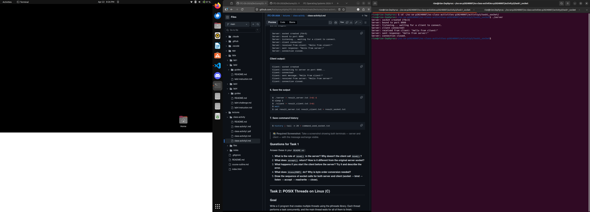
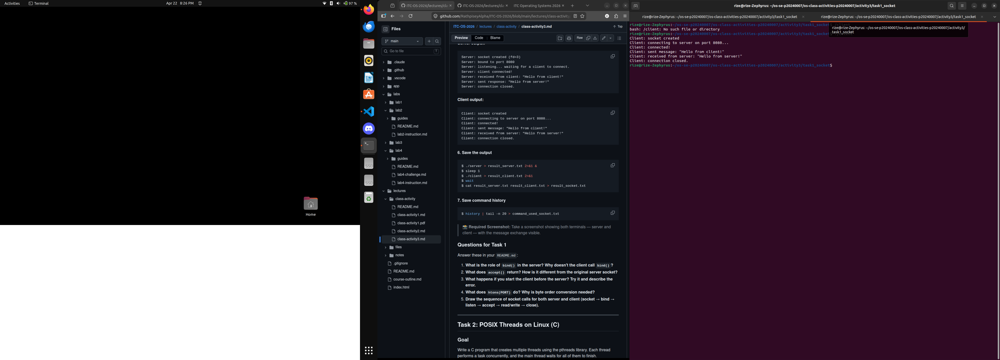
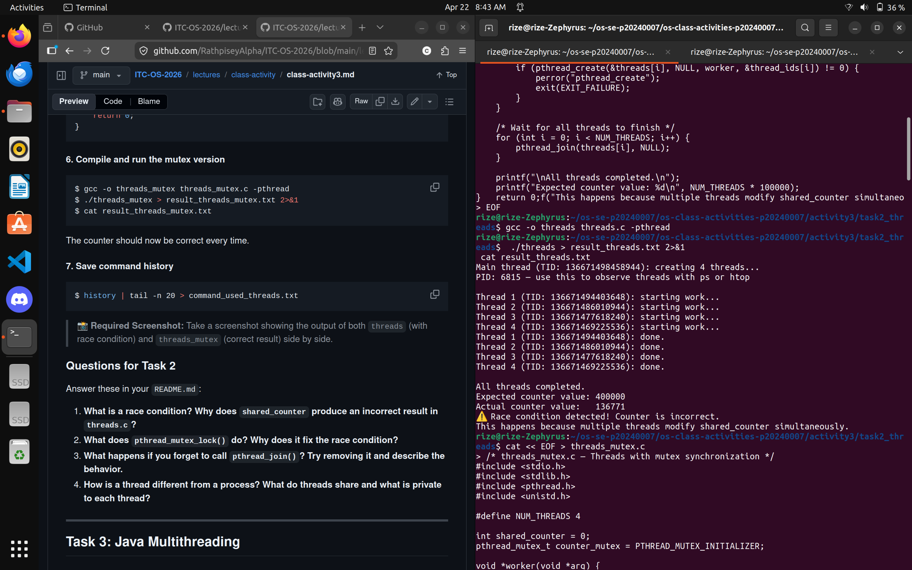
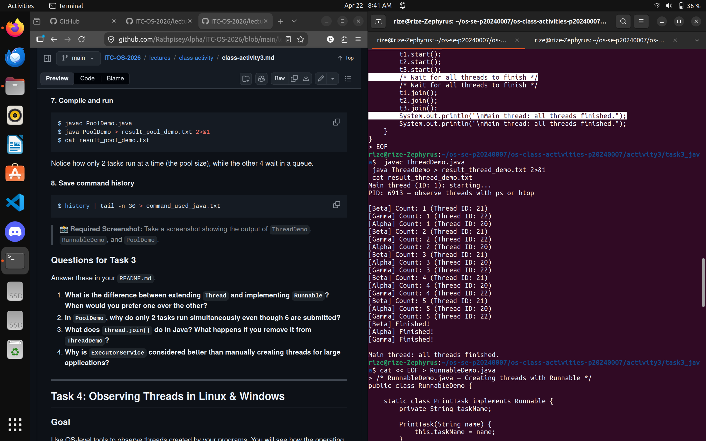
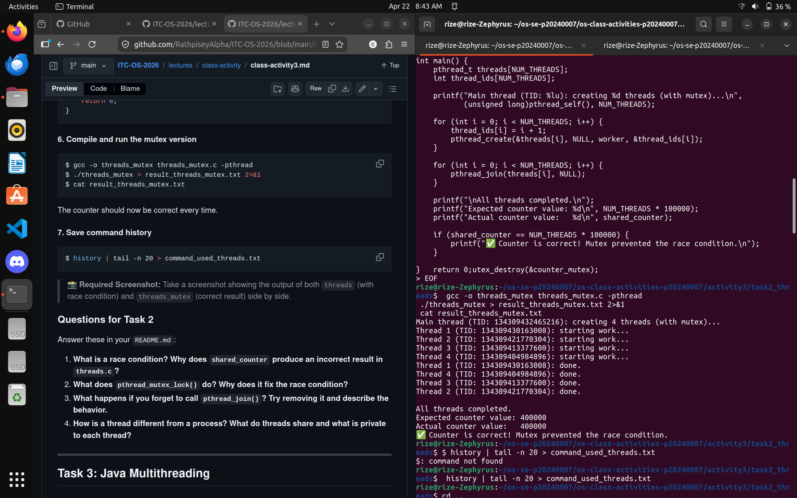
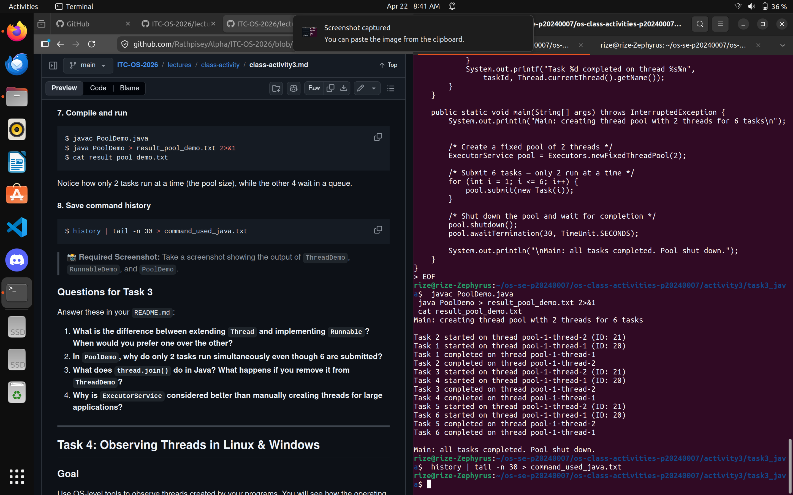
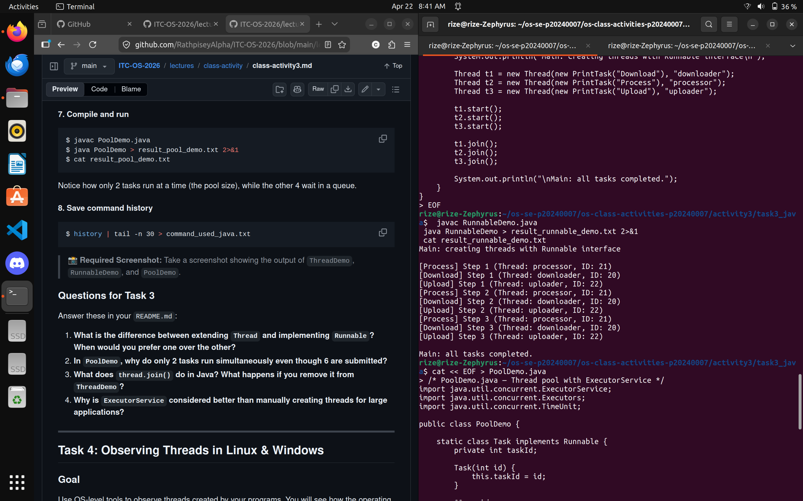
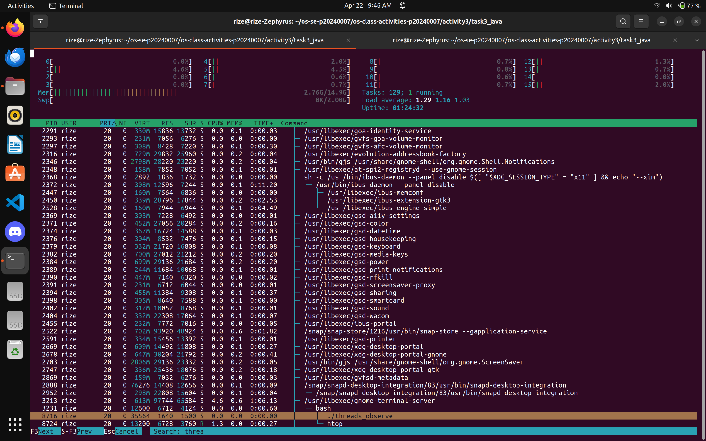
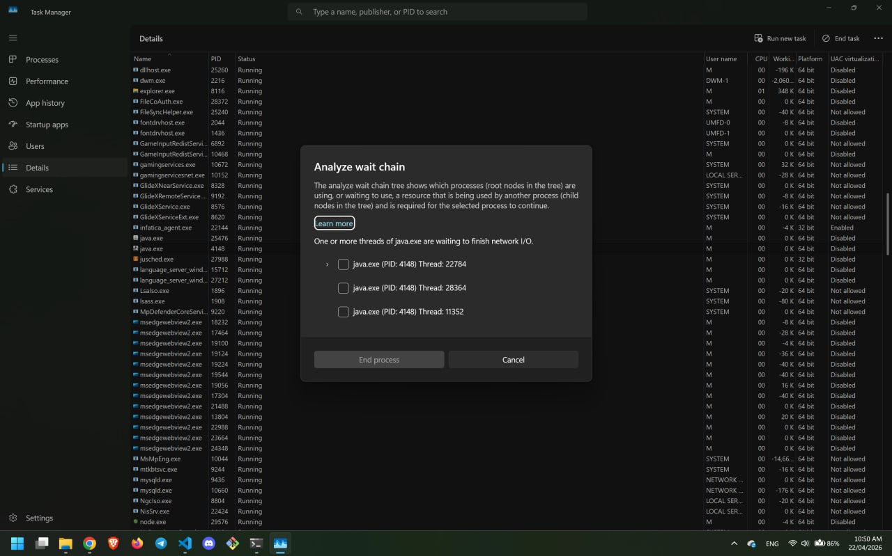

# Class Activity 3 — Socket Communication & Multithreading

- **Student Name:** Chheng Kimter
- **Student ID:** p20240007
- **Date:** 22/04/2026

---

## Task 1: TCP Socket Communication (C)

### Screenshot



### Answers

1. `bind()` ties the server to a specific port so clients know where to connect. The client doesn't need it because the OS assigns it a random port automatically.

2. `accept()` returns a new socket fd for the connected client. The original server socket keeps listening, the new one is used to actually talk to that client.

3. You get `Connection refused` because nothing is listening on that port yet.

4. `htons()` converts the port number to network byte order (big-endian) so it's correct across different CPU architectures.

5. Sequence:
```
Server: socket() → bind() → listen() → accept() → read() → send() → close()
Client: socket() → connect() → send() → read() → close()
```

---

## Task 2: POSIX Threads (C)

### Screenshot





### Answers

1. A race condition is when multiple threads read/modify shared data at the same time and overwrite each other's changes. `shared_counter++` is actually 3 steps (read, add, write) so threads can interrupt each other mid-way and lose increments.

2. `pthread_mutex_lock()` lets only one thread run the protected code at a time. Other threads block and wait their turn, so no increments get lost.

3. Without `pthread_join()` the main thread exits before the workers finish, killing the whole process early. The counter ends up way below 400000.

4. Threads share the same memory (globals, heap, code). Each thread only has its own stack and registers. Processes have completely separate memory and need IPC to communicate.

---

## Task 3: Java Multithreading

### Screenshot




### Answers

1. `extends Thread` uses up your only inheritance slot. `implements Runnable` is more flexible and lets you pass the same task to a thread pool. Prefer `Runnable`.

2. The pool only has 2 threads so only 2 tasks can run at once. The rest wait in a queue until a thread is free.

3. `join()` makes the main thread wait until that thread finishes. Without it, main prints "all done" before the threads actually finish.

4. `ExecutorService` reuses threads instead of creating new ones every time, limits how many run at once, and handles the queue automatically. Much better for performance.

---

## Task 4: Observing Threads

### Screenshots



### ps output
*(paste your ps -eLf output here)*

### Answers

1. LWP is the thread ID assigned by the Linux kernel. All threads share the same PID but each has a unique LWP.

2. Should be 5 entries (4 worker threads + 1 main thread).

3. The JVM creates extra threads for garbage collection, JIT compilation, and other internal stuff. Not all threads are from your code.

4. Linux gives way more detail — you can see individual thread IDs and states with ps and htop. Task Manager just shows a thread count.

---

## Reflection


Seeing the race condition actually produce a wrong number every run was pretty interesting. The mutex fix making it always correct makes sense once you understand why the bug happens. The /proc filesystem showing threads as folders was also cool, didn't know the OS exposed that stuff like that. I like the PID the most. Knowing how the OS actually tracks threads makes it easier to write concurrent programs because once you understand that threads share the same memory, you know exactly why race conditions happen and where to put a mutex to fix it instead of just guessing.