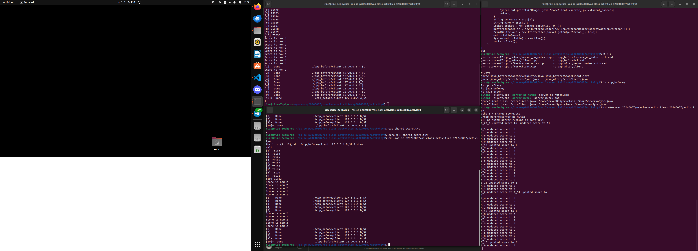
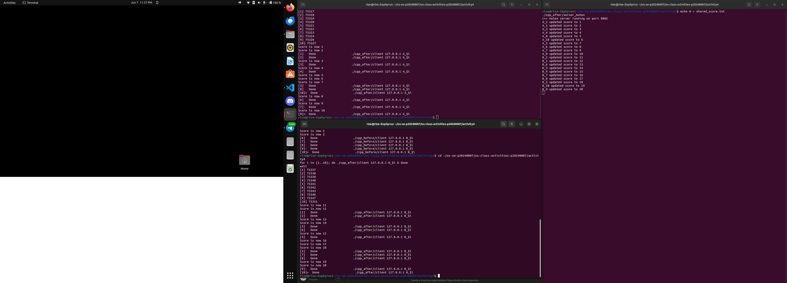
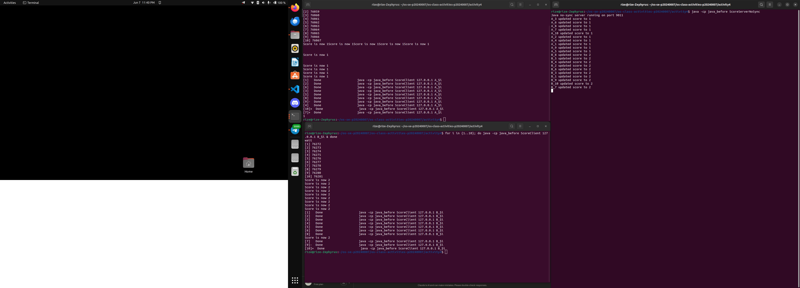
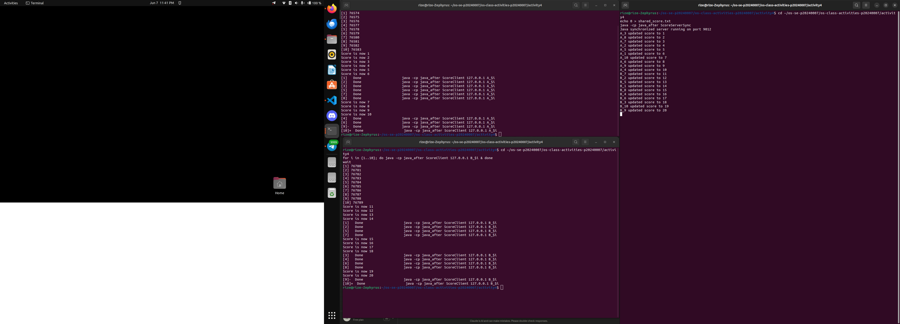

# Class Activity 4 — Shared File API

- **Student Name:** Chheng Kimter
- **Student ID:** p20240007
- **Partner Name:** Thai Monika
- **Partner Student ID:** p20240007
- **Server Machine Owner:** Chheng Kimter
- **Server IP Address:** 127.0.0.1

---

## Task 1: C++ Before Mutex

- Expected score after 20 total client requests: 20
- Actual score: 2
- What happened: Multiple threads read the same score value at the same time before any of them could write back. They all incremented from the same base value, so most updates were lost. This is a classic race condition.

---

## Task 2: C++ After Mutex

- Expected score after 20 total client requests: 20
- Actual score: 20
- What changed after adding mutex: The std::lock_guard<std::mutex> forces each thread to wait its turn before entering the critical section. Only one thread can read and write the file at a time, so no updates are lost.

---

## Task 3: Java Before Synchronized

- Expected score after 20 total client requests: 20
- Actual score: 2
- What happened: Same race condition as the C++ version. Multiple threads called updateScore() at the same time, read the same value, and overwrote each other's results.

---

## Task 4: Java After Synchronized

- Expected score after 20 total client requests: 20
- Actual score: 20
- What changed after adding synchronized: The synchronized keyword on updateScore() ensures only one thread can execute it at a time. All 20 requests are processed one by one, giving the correct final score.

---

## Questions

1. Why should clients send requests to the server instead of writing the file directly?

   When multiple clients write to the same file directly, there is no central point of control. Each client opens, reads, and writes the file independently, which easily causes race conditions. A server acts as a single gatekeeper — all updates go through it, making it easier to control access and apply synchronization.

2. Why does the server still have a race condition before mutex or synchronized?

   The server spawns a new thread for each client request. These threads run concurrently and all call the same update function at the same time. Without synchronization, multiple threads can read the file simultaneously, each seeing the same old value, then all write back an incremented version of that same value. Most updates get overwritten.

3. In the C++ fixed version, what does std::lock_guard<std::mutex> protect?

   It protects the entire update_score() function — the file read, the sleep delay, the increment, and the file write. Only one thread can hold the lock at a time. All other threads block at the lock_guard line until the current thread finishes and the lock is released.

4. In the Java fixed version, what does synchronized protect?

   The synchronized keyword on updateScore() locks on the class object. Only one thread can execute that method at a time. Any thread that tries to call it while another is inside will wait until the first thread returns.

5. Why is the final score expected to be 20 when Student A sends 10 requests and Student B sends 10 requests?

   Each request increments the score by 1. With 10 requests from Student A and 10 from Student B, there are 20 total increments. If all updates are applied correctly without being overwritten, the final score must be 20.

6. What could happen if two separate servers update the same file at the same time?

   Even if each server uses a mutex internally, the mutex only protects threads within that same process. Two separate server processes have no shared mutex, so they can still read and write the file at the same time and cause a race condition at the file system level. A file lock or external coordination mechanism would be needed to handle this safely.

---

## Reflection

Both C++ and Java solve the race condition by ensuring mutual exclusion — only one thread can execute the critical section at a time. C++ uses std::mutex with std::lock_guard, which is explicit and requires the developer to declare and manage the mutex object. Java uses the synchronized keyword directly on the method, which is simpler to write but less flexible. Both approaches work correctly and produced a consistent score of 20 in every test after synchronization was applied. This activity showed that even when a server is the only program touching a shared file, internal thread safety is still required. A server alone does not prevent race conditions — synchronization inside the server does.