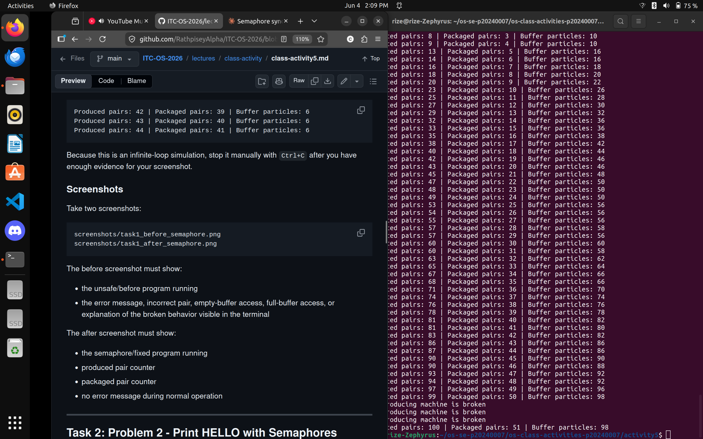
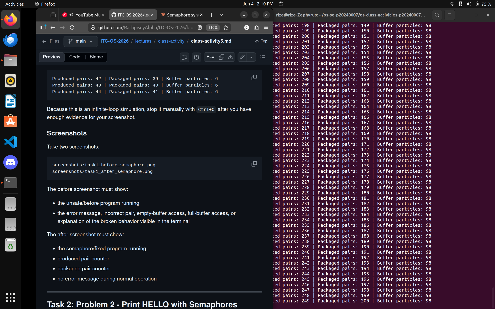
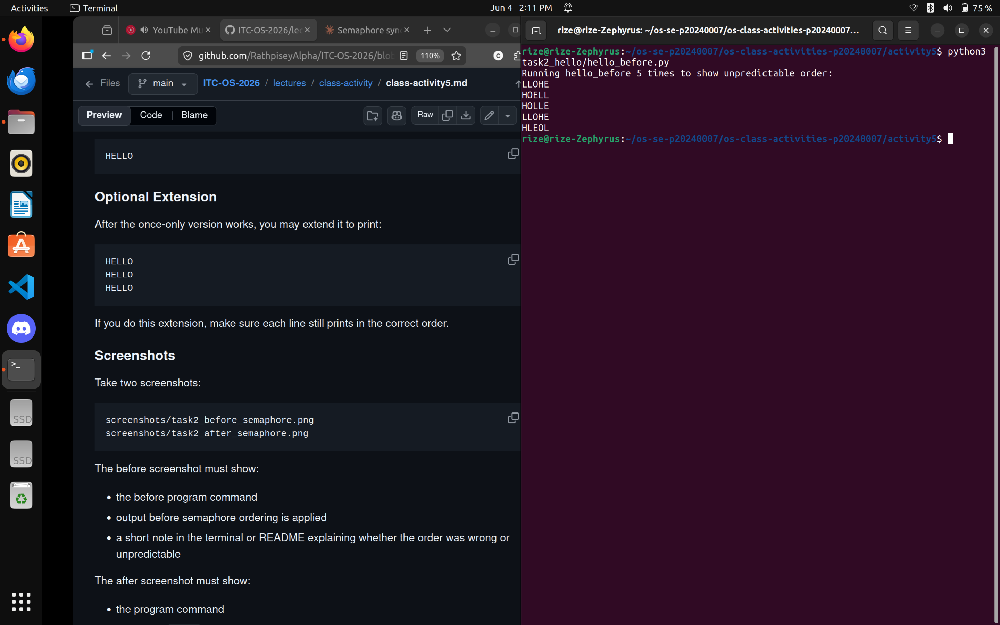
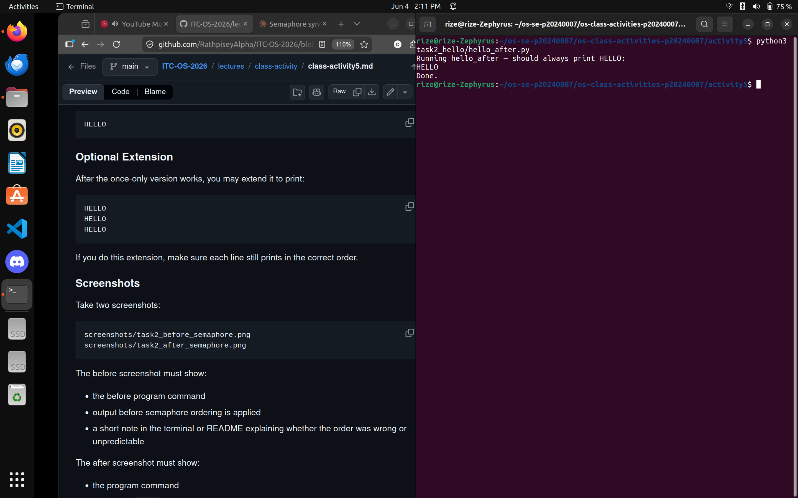

# Class Activity 5 - Semaphores
- **Student Name:** Chheng Kimter
- **Student ID:** p20240007
- **Programming Language Used:** Python 3

---

## Task 1A: Particle Pair Buffer Before Semaphores

- What error or incorrect behavior appeared: Without semaphores, multiple producer threads write to the buffer concurrently without locking. The consumer can also pop particles while a producer is mid-write, causing mismatched pairs or an empty-buffer access, triggering one of the required error messages.
- Why did this happen without semaphore protection: There is no mutual exclusion around the buffer. Threads interleave freely, so a producer may find space available and then be preempted before writing, while another thread modifies the buffer in between.

---

## Task 1B: Particle Pair Buffer After Semaphores

- Number of producer machines: 3
- Buffer capacity: 100 particles (50 pairs)
- Semaphores used: `empty_pairs` (initial 50), `full_pairs` (initial 0), `mutex` (initial 1)
- Produced pair count shown in screenshot: (see screenshot)
- Packaged pair count shown in screenshot: (see screenshot)
- Did any error appear during normal operation? No

---

## Task 2A: HELLO Before Semaphores

- Output before semaphore ordering: Letters print in a non-deterministic order (e.g., LHELO, LLHEO, OHELL, etc.)
- Why this output can be wrong or unpredictable: All three threads start at the same time with random small delays. The OS scheduler decides which thread runs first, so the print order is different every run.

---

## Task 2B: HELLO After Semaphores

- Processes or threads used: 3 threads (process1, process2, process3)
- Semaphores used: `start_h` (1), `after_e` (0), `after_l1` (0), `after_l2` (0)
- Final output: HELLO

---

## Questions

1. **In Task 1, why does a producer need to wait before adding a pair to the buffer?**
   A producer must wait on `empty_pairs` to ensure there are at least two free consecutive slots before writing. Without waiting, it could overflow the buffer (capacity 100 particles) and trigger "The producing machine is broken."

2. **In Task 1, why does the consumer need to wait before removing a pair from the buffer?**
   The consumer waits on `full_pairs` to guarantee at least one complete pair is in the buffer. Without this, it might read from an empty buffer and trigger "The packaging machine is broken."

3. **Which semaphore protects the critical section in your particle buffer program?**
   `mutex` (initial value 1) protects the critical section — the actual read/write access to the shared `buffer` list and the counters.

4. **How does your program verify that P1 and P2 belong to the same pair?**
   Each particle name encodes its machine and pair ID (e.g., `M2-17-P1`). The consumer extracts the base prefix (`M2-17`) from both particles and checks they are equal. If `base1 != base2`, it prints "Pairs are incorrect" and stops.

5. **In Task 2, why can the program print letters in the wrong order without semaphores?**
   The three threads all start concurrently. Without any ordering constraint, the OS can schedule them in any order. A fast `process3` can print `O` before `process1` prints `H`, producing garbage like `OELLH`.

6. **Which semaphore or synchronization step forces H to print before E, L, L, and O?**
   `start_h` (initial value 1) allows only Process 1 to run first. Process 1 prints `H` then `E`, then signals `after_e`. Process 2 cannot print either `L` until it acquires `after_e`, and Process 3 cannot print `O` until it acquires `after_l2` — so `H` is always first.

7. **What could cause deadlock in either of your simulations?**
   In Task 1: if a producer acquires `mutex` and then tries to acquire `empty_pairs` while the consumer holds `empty_pairs` waiting for `mutex`, a circular wait forms. The design avoids this by always acquiring the counting semaphore *before* `mutex`.
   In Task 2: if `after_l1` is used to both signal and then immediately re-acquire within Process 2 without the signal being released first, Process 2 would block on itself. The design calls `release()` before the second `acquire()` to prevent this.

---

## Reflection
These simulations made the role of semaphores very concrete. In Task 1, I could see that even a small race window — one thread reading `len(buffer)` while another is appending — is enough to corrupt data. The three-semaphore design (empty_pairs, full_pairs, mutex) cleanly separates capacity-counting from mutual exclusion. In Task 2, the ordering problem showed that semaphores are not only for protecting shared data but also for synchronizing the *sequence* of events. A semaphore initialized to 0 acts like a gate that one thread opens for another, which is a powerful primitive for enforcing happens-before relationships.
