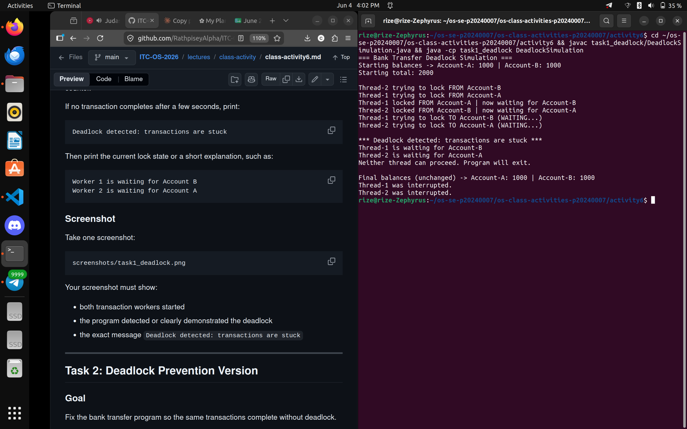
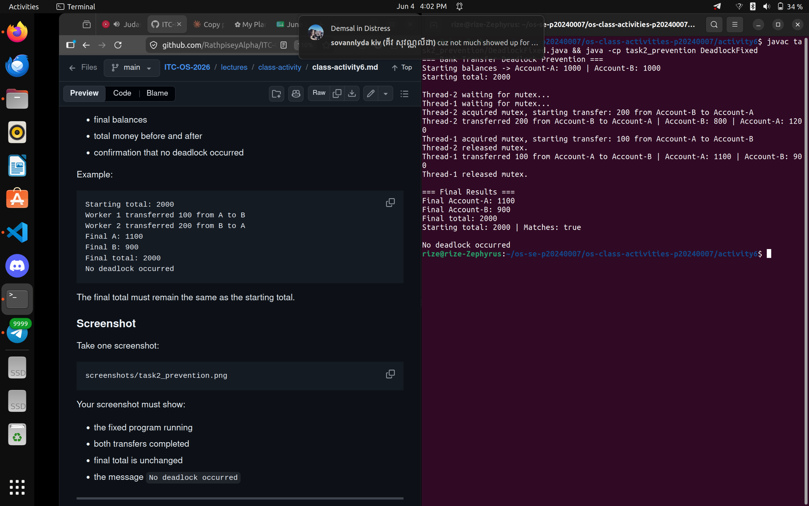

# Class Activity 6 - Deadlock Simulation

- **Student Name:** Chheng Kimter
- **Student ID:** p20240007
- **Programming Language Used:** Java

---

## Task 1: Deadlock Version

- Shared resources: Account-A and Account-B
- Transaction 1: Transfer 100 from Account-A to Account-B (Thread-1)
- Transaction 2: Transfer 200 from Account-B to Account-A (Thread-2)
- Deadlock message shown: `Deadlock detected: transactions are stuck`
- Explanation of why the program got stuck: Thread-1 locks Account-A and waits for Account-B. Thread-2 locks Account-B and waits for Account-A. Neither can proceed because each holds the lock the other needs — circular wait.

---

## Task 2: Deadlock Prevention Version

- Prevention strategy used: Single shared semaphore mutex (mutual exclusion over the entire transfer)
- Semaphore mutex initial value: 1
- Starting total: 2000
- Final total: 2000
- Did both transfers complete? Yes
- Why no deadlock occurred: Only one thread can hold the mutex at a time. The second thread waits until the first finishes completely before acquiring the mutex. No thread holds one account lock while waiting for another, so circular wait is impossible.

---

## Questions

1. **What are the two shared resources?**
   Account-A and Account-B are the two shared resources.

2. **Which line creates hold-and-wait in Task 1?**
   The section where `from.lock.acquire()` is called first, then `Thread.sleep(100)`, then `to.lock.acquire()`. The thread holds the first lock while sleeping and then waits for the second lock.

3. **How does Task 1 create circular wait?**
   Thread-1 holds Account-A's lock and waits for Account-B's lock. At the same time, Thread-2 holds Account-B's lock and waits for Account-A's lock. Each thread is waiting for a resource held by the other — a circular dependency.

4. **Why does Task 1 need a watchdog or timeout?**
   Without a watchdog, a deadlocked program hangs silently forever. The watchdog detects that neither transfer completed after a set time and prints the deadlock message so the state is visible and the program can exit.

5. **How does the single semaphore mutex prevent deadlock in Task 2?**
   The mutex ensures only one thread can perform a transfer at a time. Thread-2 must wait until Thread-1 fully releases the mutex before it can start. This means no thread ever holds a partial set of locks while waiting for another.

6. **Which deadlock condition does Task 2 remove?**
   It removes **circular wait** and **hold-and-wait**. Only one thread enters the critical section at a time, so no two threads can simultaneously hold resources the other needs.

7. **Why must the final total balance remain unchanged?**
   A transfer moves money between accounts — it does not create or destroy money. If the total changes, it means the program lost or duplicated funds due to a race condition or incomplete transfer, which would be a correctness bug.

---

## Reflection

This activity showed that deadlock is not just a theoretical problem — it appears naturally in any system where multiple threads compete for multiple shared resources in different orders. In banking and database systems, consistent lock ordering and mutex-based critical sections are essential to guarantee both safety (no deadlock) and correctness (no lost money). A single semaphore is simple and reliable for low-concurrency cases, while lock ordering allows higher concurrency without the serialization overhead.
