# Class Activity 7 - Reasoning About Deadlock

- **Student Name:** Chheng Kimter
- **Student ID:** p20240007
- **Personalization:** a = 7 (last digit), b = 0 (second-to-last digit)
  - Max[P0][A] = 7 + (7 mod 3) = **8**
  - Max[P2][C] = 2 + (0 mod 4) = **2**

---

## Task 1 — Resource Allocation Graphs

### Part A

**Graph 1 — Prediction:**
- P0 holds R0, requests R1 → P1 holds R1, requests R2 → P2 holds R2, requests R0 → back to P0
- Cycle exists: `P0 → R1 → P1 → R2 → P2 → R0 → P0`
- **Deadlocked.** Every process waits for a resource held by the next — no one can ever finish.

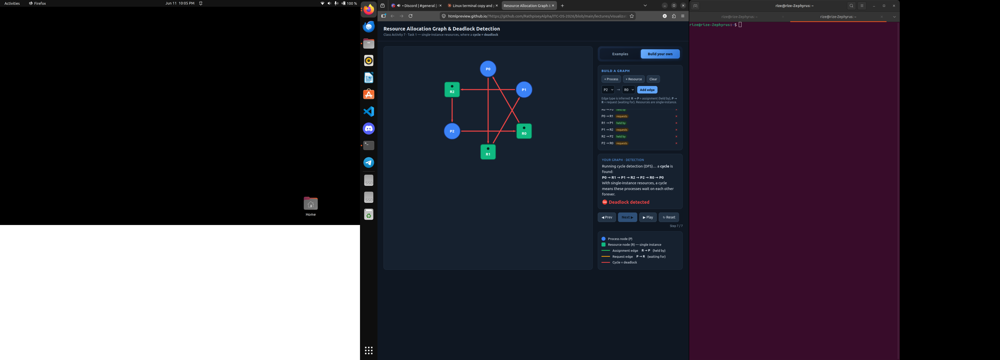
Matched tool? Yes — cycle and deadlock confirmed.

---

**Graph 2 — Prediction:**
- P0 holds R0, requests R1 → P1 holds R1, requests R2 → P2 holds R2, requests nothing
- **No cycle. No deadlock.**
- P2 requests nothing → finishes first, releases R2 → P1 unblocks → P0 unblocks.
- Finishing order: P2 → P1 → P0

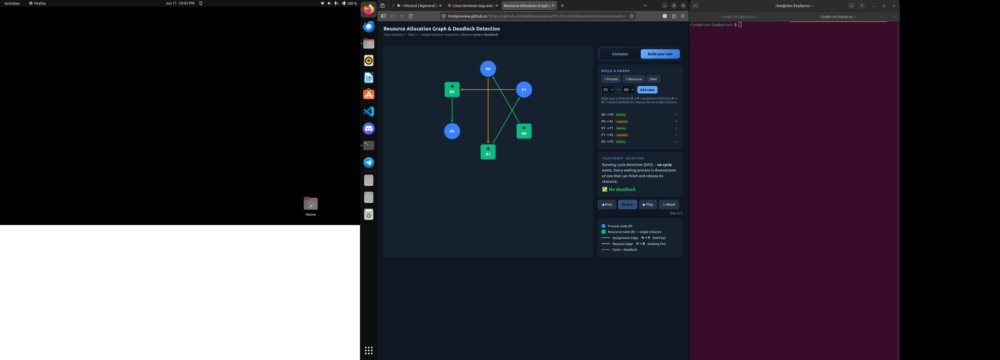
Matched tool? Yes — no cycle, no deadlock confirmed.

---

### Part B

**(i) Deadlocked 3×3 graph**

Edges:
R0→P0  P0→R1
R1→P1  P1→R2
R2→P2  P2→R0
Each process holds one resource and waits for the one held by the next — forms a closed circular wait through all three processes.

---

**(ii) No-cycle graph (4 nodes, 1 request edge)**

Edges:
R0→P0  P0→R1
R1→P1
P1 holds R1 and requests nothing → P1 finishes, releases R1 → P0 unblocks. One request edge exists but no cycle, so no deadlock.

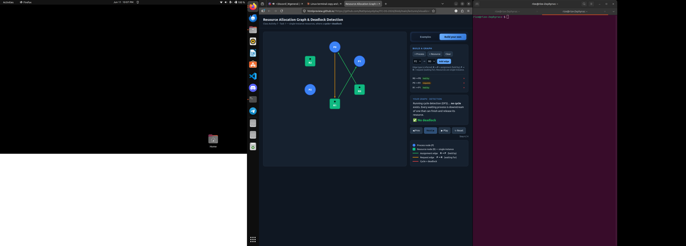

---

## Task 2 — Cycle ≠ Deadlock

### Warm-up

**1. "Cycle, NO deadlock" — why not deadlocked:**
A process outside the cycle holds a resource and requests nothing, so it finishes on its own. It releases a spare instance that satisfies another process's request, breaking the cycle. A cycle means circular dependency, not that everyone is permanently stuck.

**2. Single change that causes deadlock:**
The spare free instance is removed (or consumed by an extra allocation). With zero free instances, no process can satisfy its request, no one finishes first, and all are permanently stuck.

---

### Part A — Given Scenario
        Allocation        Request
        R1  R2  R3        R1  R2  R3
P1           1   0   0         0   1   0
P2           0   1   1         1   0   0
P3           1   0   1         0   0   0
Total: R1=2, R2=1, R3=2

**Available:**
ΣAlloc = R1:2, R2:1, R3:2
Available = [2,1,2] − [2,1,2] = **[0, 0, 0]**

**Cycle:** P1 holds R1, requests R2. P2 holds R2+R3, requests R1.
Path: `P1 → R2 → P2 → R1 → P1`
P3 is in the graph but requests nothing — P3 can finish first and break the chain.

**Reduction:**

| Step | Process | Why Request ≤ Work | Work after release |
|------|---------|--------------------|--------------------|
| 1 | P3 | [0,0,0] ≤ [0,0,0] ✓ (requests nothing) | [0,0,0]+[1,0,1] = [1,0,1] |
| 2 | P2 | [1,0,0] ≤ [1,0,1] ✓ | [1,0,1]+[0,1,1] = [1,1,2] |
| 3 | P1 | [0,1,0] ≤ [1,1,2] ✓ | [1,1,2]+[1,0,0] = [2,1,2] |

**Conclusion: NOT deadlocked.** Finishing order: P3 → P2 → P1

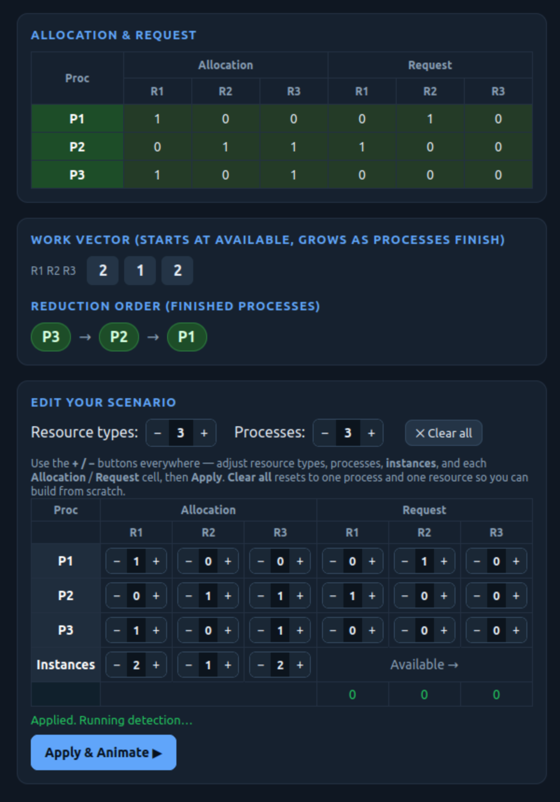

---

**After changing P3's request to [0,1,0]:**

Prediction: **DEADLOCKED.**
Available=[0,0,0]. P3 now needs R2=1 but Work R2=0 — P3 is blocked too.
No process satisfies Request ≤ Work. P3 was the only one that could start the reduction; removing its free pass deadlocks all three.

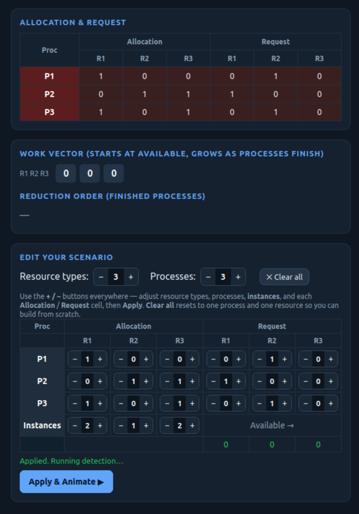

---

### Part B — My Own Scenario

Resources: R1 (2 instances), R2 (1 instance). Processes: P1, P2, P3.
        Allocation    Request
        R1  R2        R1  R2
P1           1   0         0   1
P2           0   1         1   0
P3           1   0         0   0

Available = [2,1]−[2,1] = [0,0]. Cycle exists: P1→R2→P2→R1→P1.
P3 requests nothing → finishes, releases R1 → P2 unblocks → P1 unblocks.
**NOT deadlocked.**

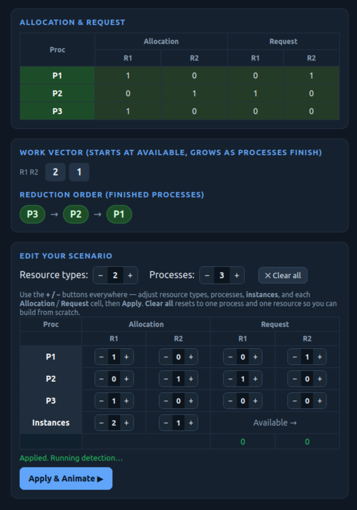

**One change → deadlock:** Change P3's request to [0,1].
Now P3 needs R2 (held by P2) → P3 is blocked. No process can start the reduction. All stuck.

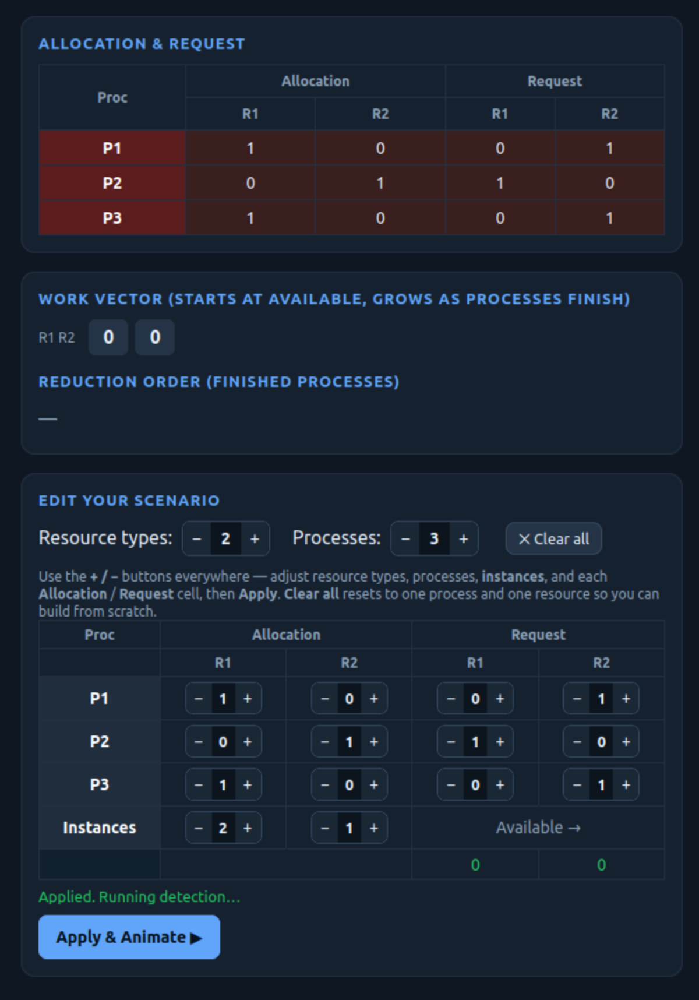

---

## Task 3 — Banker's Algorithm

**Personalized Max:**
    Allocation     Max          Need (Max − Alloc)
    A   B   C      A   B   C    A   B   C
P0      0   1   0      8   5   3    8   4   3
P1      2   0   0      3   2   2    1   2   2
P2      3   0   2      9   0   2    6   0   0

**Available:**
ΣAlloc: A=5, B=1, C=2
Available = [10,5,7] − [5,1,2] = **[5, 4, 5]**

**Safety trace:**

| Step | Process | Why Need ≤ Work | Work after release |
|------|---------|-----------------|--------------------|
| 1 | P1 | [1,2,2] ≤ [5,4,5] ✓ | [5,4,5]+[2,0,0] = [7,4,5] |
| 2 | P2 | [6,0,0] ≤ [7,4,5] ✓ | [7,4,5]+[3,0,2] = [10,4,7] |
| 3 | P0 | [8,4,3] ≤ [10,4,7] ✓ | [10,4,7]+[0,1,0] = [10,5,7] |

**Conclusion: SAFE. Safe sequence = P1 → P2 → P0**

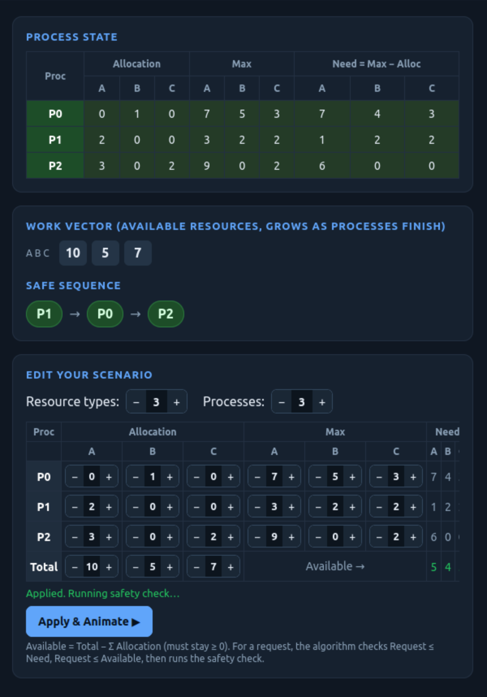
Matched tool? Yes.

---

**Request GRANTED: P1 requests [1, 0, 0]**
- Check 1: [1,0,0] ≤ Need[1,2,2] ✓
- Check 2: [1,0,0] ≤ Available[5,4,5] ✓
- Check 3: Tentative Available=[4,4,5] → safe sequence P1→P2→P0 still exists ✓
- **GRANTED**

---

**Request DENIED: P2 requests [5, 0, 0]**
- Check 1: [5,0,0] ≤ Need[6,0,0] ✓
- Check 2: [5,0,0] ≤ Available[5,4,5] ✓
- Check 3: Tentative Available=[0,4,5]. Every process still needs A≥1 but A=0 — no process can proceed. UNSAFE.
- **DENIED** (fails Check 3)

---

## Task 4 — Semaphores and Deadlock

> Modeling: process that ran wait(s) but not signal(s) yet = **holds** s. Process blocked at wait(s) = **requests** s.

**Case 1 — s1=s2=s3=1: NO**
All three processes acquire semaphores in ascending order (s1→s2, s2→s3, s1→s2→s3). Circular wait is impossible. In the worst case P3 blocks on s1, but s3 is free so P2 finishes, then P1, then P3.

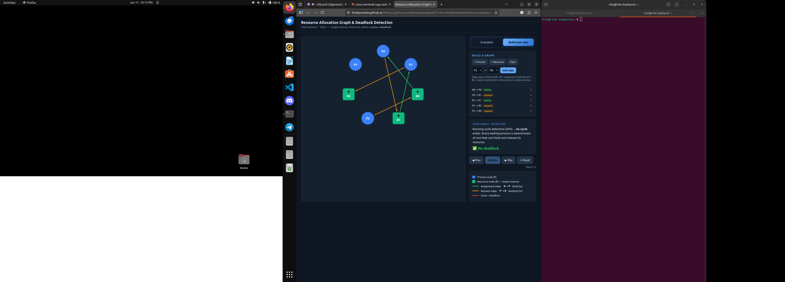

---

**Case 2 — s1=s2=s3=1: YES**
P3 now acquires s2→s3→s1 (breaks ascending order).

Deadlock interleaving:
1. P1 acquires s1, blocks at s2.
2. P3 acquires s2, acquires s3, blocks at s1.
3. P2 tries s2 → blocked (P3 holds it).

Wait-for cycle: `P1 → s2 → P3 → s1 → P1`
P3 holds what P1 needs while waiting for what P1 holds — circular hold-and-wait.

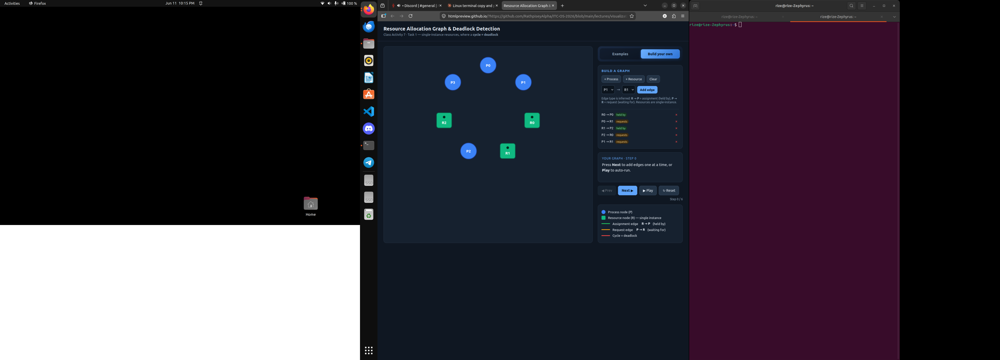

---

**Case 3 — s1=2, s2=s3=1: NO**
Same code as Case 2 but s1 has 2 instances. P1 takes one unit of s1, leaving one free. When P3 reaches wait(s1), the second free unit is available — P3 is never blocked. P3 finishes and releases everything, breaking the chain before it can form.

The extra s1 instance prevents P3 from ever blocking at wait(s1), so the circular wait from Case 2 can never form.

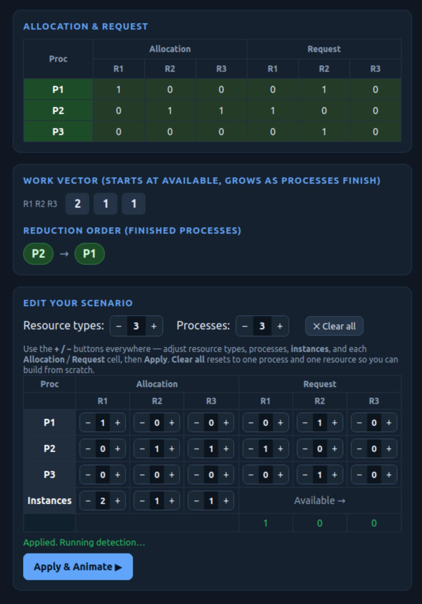

---

## Task 5 — Applied Concepts

**1. Four necessary conditions — office printer/scanner example:**
- Alice and Bob each need both the printer and scanner to finish their job.
- **Mutual Exclusion:** Only one person can use the printer at a time.
- **Hold and Wait:** Alice holds the printer and waits for the scanner without releasing it.
- **No Preemption:** Bob cannot take the printer from Alice by force.
- **Circular Wait:** Alice waits for the scanner (Bob has it); Bob waits for the printer (Alice has it).

Easiest to remove: **Hold and Wait** — require both devices be requested together. Cost: efficiency drops because a person must wait for both to be free simultaneously even if one is already available.

---

**2. Cycle in single-instance vs. multi-instance:**
In single-instance, each resource has only one unit, so a cycle means every process in it is permanently blocked — cycle = deadlock. In multi-instance, spare instances may exist that let a process outside the cycle finish first and release resources, breaking the cycle — so a cycle is necessary but not sufficient for deadlock.

---

**3. Unsafe vs. deadlocked state:**
A deadlocked state means processes are already permanently stuck. An unsafe state means the OS cannot guarantee all processes will finish — deadlock might happen later, but has not yet.

Example: Available=[1,0], P0 needs [2,0], P1 needs [0,1]. Neither can proceed → unsafe. But if P1 has not requested yet, it is not deadlocked yet.

---

**4. Avoidance (Banker's) vs. Detection + Recovery:**
- **Banker's:** Checks safety before every grant. Cost: processes must declare max demand upfront; overhead on every request. Best for: predictable batch/real-time systems (e.g. embedded systems).
- **Detection + Recovery:** Lets requests proceed freely, detects deadlock periodically, kills/rolls back a process. Cost: deadlock can actually occur; work may be lost. Best for: databases and interactive systems with unpredictable workloads (e.g. DBMS with transaction rollback).

---

**5. Why Banker's needs maximum demand declared upfront:**
The safety algorithm simulates worst-case future requests to check if resources can always be reclaimed. Without knowing the maximum, the OS cannot guarantee a safe sequence exists.

Real-world problem: most programs do not know their peak resource needs at start — it depends on runtime input. This forces over-estimation (wasting resources) or makes Banker's impractical for dynamic workloads like web servers.

---

## Reflection

This activity showed that a cycle in a multi-instance graph is a warning, not a verdict. A spare free instance — or one process that requests nothing — is enough to break the chain before deadlock forms. Task 2 and Task 4 Case 3 both demonstrated this: removing just one free unit turned a live system into a deadlock.

On avoidance vs. detection: Banker's is safe but needs advance knowledge and adds overhead to every allocation. Detection + recovery is more flexible but accepts that deadlock may actually happen. Real systems like databases prefer detection with rollback because workloads are too dynamic to declare maximums upfront. OS kernels avoid internal deadlocks cheaply by enforcing lock-ordering (the same principle that kept Case 1 safe).
