# OS Lab 1 Submission

- **Student Name:** Chheng Kimter
- **Student ID:** p20240007

---

## Task 1: Operating System Identification

Briefly describe what you observed about your OS and Kernel here.

In this task, I used uname -a to view the system's kernel version, architecture (e.g., x86_64), and hostname. Using lsb_release -a provided more user-friendly details about the Linux distribution, specifically confirming that I am running Ubuntu. These commands are essential for troubleshooting, as they tell you exactly what "flavor" of Linux and what version of the kernel are managing the hardware.

<!-- Insert your screenshot for Task 1 below: -->
<!-- SCREENSHOT REQUIREMENT: Show the terminal after running uname -a and lsb_release -a, or the contents of your task1_os_info.txt file. -->
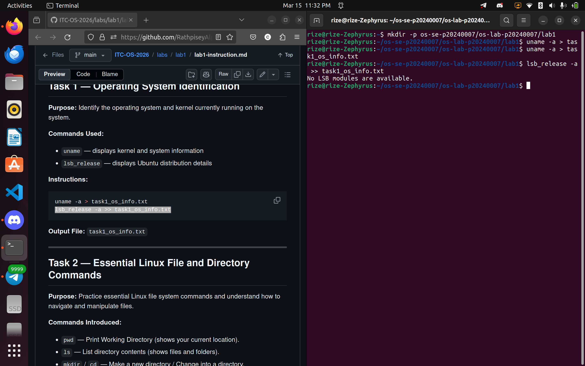
---

## Task 2: Essential Linux File and Directory Commands

Briefly describe your experience creating, moving, and deleting files.

I practiced navigating the Linux filesystem using pwd to confirm my location and ls to view contents. I learned that touch creates empty files quickly, while echo combined with redirection (>) allows for writing data into files from the terminal. The most important takeaway was the difference between cp (copying) and mv (moving/renaming), and using rm to delete files. Using .. was a helpful shortcut to interact with the parent directory without typing the full path.

<!-- Insert your screenshot for Task 2 below: -->
<!-- SCREENSHOT REQUIREMENT: Show the terminal running the file manipulation commands (mkdir, touch, cp, mv, rm) or the final cat of your task2_file_commands.txt file. -->

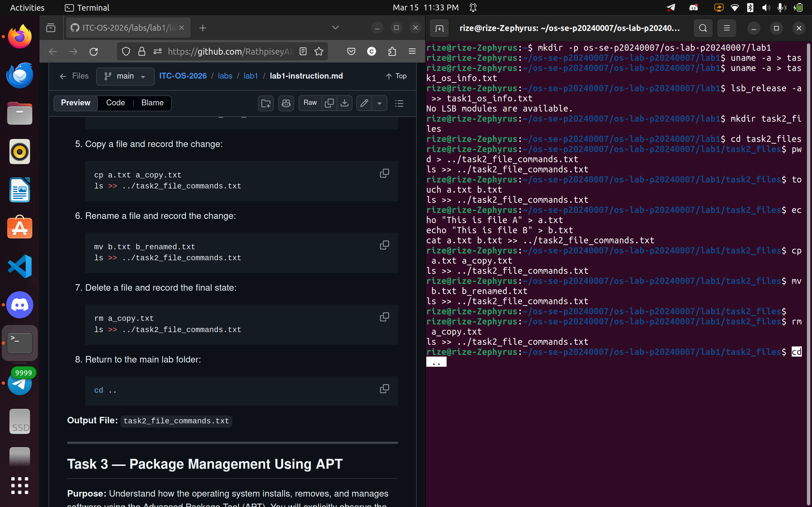

---

## Task 3: Package Management Using APT

Explain the difference you observed between `remove` and `purge`.

remove vs. purge: The key difference observed was how the OS handles configuration files:

    apt-get remove: Uninstalls the application binaries (the executable program) but leaves the configuration files (in /etc/mc) untouched. This is useful if you plan to reinstall the app later and want to keep your settings.

    apt-get purge: Removes everything—the binaries and the configuration files. After purging, the /etc/mc directory was completely gone, leaving no trace of the software on the system.

<!-- Insert your screenshot for Task 3 below: -->
<!-- SCREENSHOT REQUIREMENT: Show the output of ls -ld /etc/mc after running apt-get remove (folder still exists) versus after running apt-get purge (folder is gone). -->
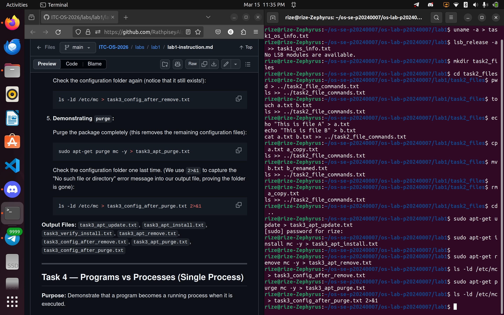
---

## Task 4: Programs vs Processes (Single Process)

Briefly describe how you ran a background process and found it in the process list.

I learned that a program is just a static file sitting on the disk (like the sleep command), while a process is an active, running instance of that program in memory. By adding an ampersand (&) to the end of the sleep 120 command, I sent the process to the background. Using ps allowed me to see the process ID (PID) and confirm that the OS was tracking its execution even though it wasn't taking up my active terminal prompt.

<!-- Insert your screenshot for Task 4 below: -->
<!-- SCREENSHOT REQUIREMENT: Show the terminal where you ran sleep 120 & and the subsequent ps output showing the sleep process running. -->
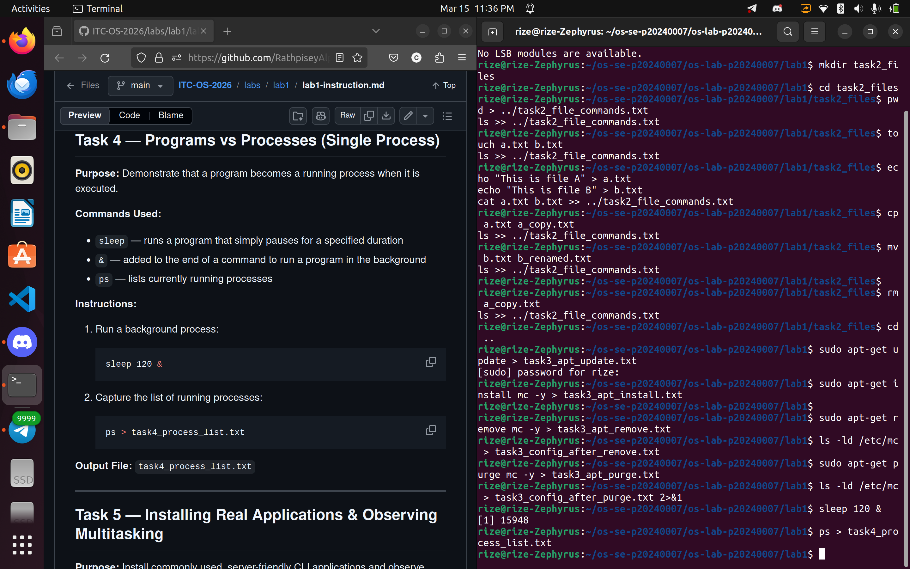
---

## Task 5: Installing Real Applications & Observing Multitasking

Briefly describe the multitasking environment and the background web server.

By running multiple instances of sleep and a python3 web server simultaneously, I observed the Operating System's ability to manage multitasking. Even though I only have one terminal session, the OS kernel schedules CPU time for all these background processes. Tools like htop (which I installed via APT) provide a dynamic view of how the OS balances resources like CPU and RAM across these various tasks.

<!-- Insert your screenshot for Task 5 below: -->
<!-- SCREENSHOT REQUIREMENT: Show the terminal ps output capturing the multiple background tasks (sleep and python3 server) running at the same time. -->

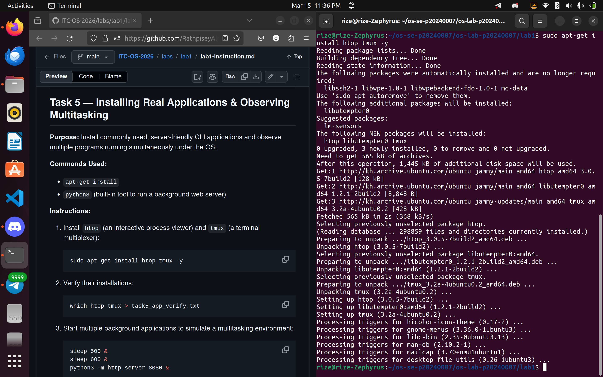
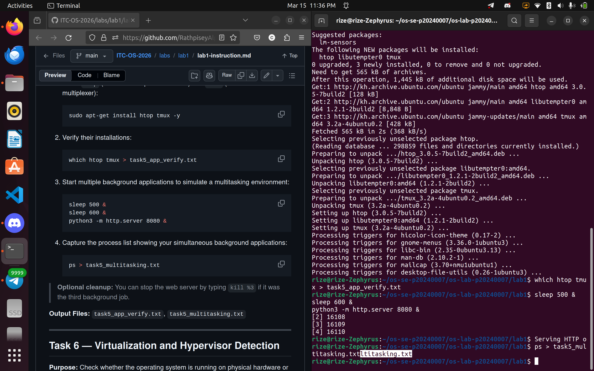
---

## Task 6: Virtualization and Hypervisor Detection

State whether your system is running on a virtual machine or physical hardware based on the command outputs.

Running systemd-detect-virt confirmed that my environment is virtualized (likely showing wsl or microsoft). The lscpu command also identified a "Hypervisor vendor," which proves that the OS is not running directly on physical hardware ("bare metal"), but is instead running as a guest on top of a software layer managed by the host OS.

<!-- Insert your screenshot for Task 6 below: -->
<!-- SCREENSHOT REQUIREMENT: Show the terminal output of the systemd-detect-virt and lscpu commands. -->
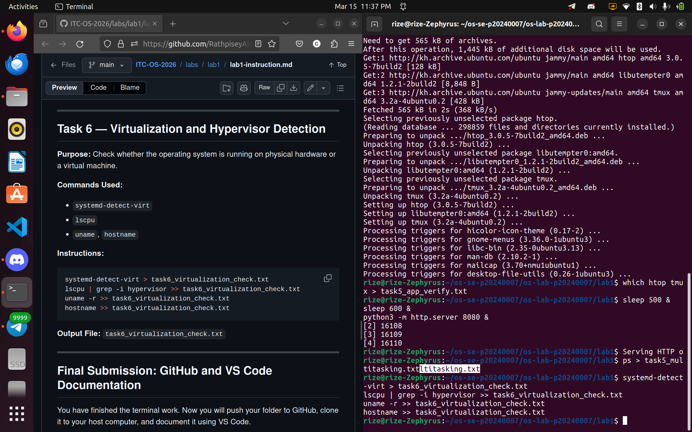
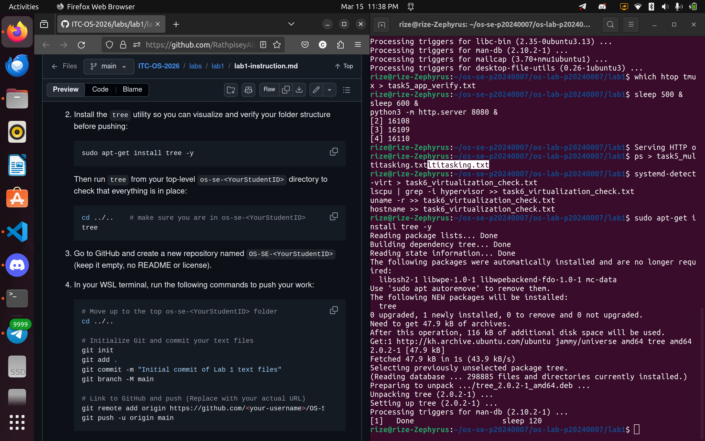
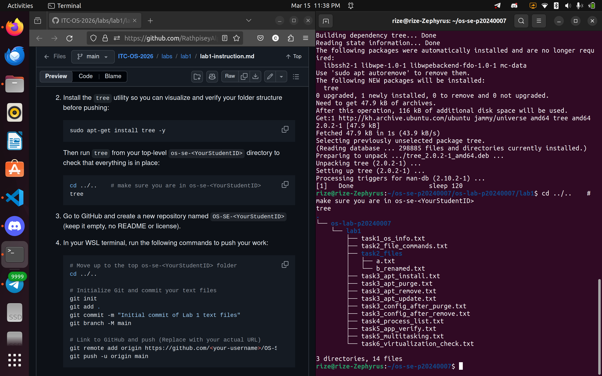
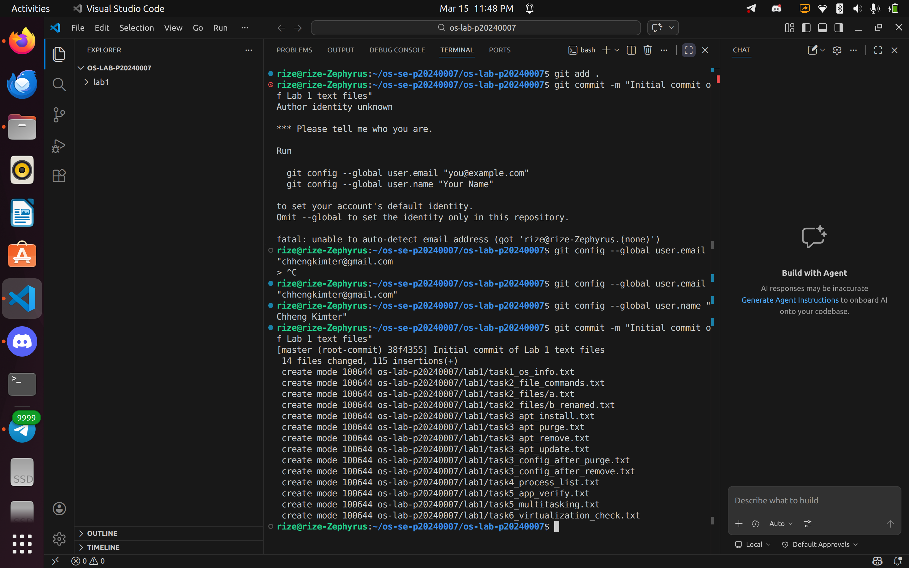
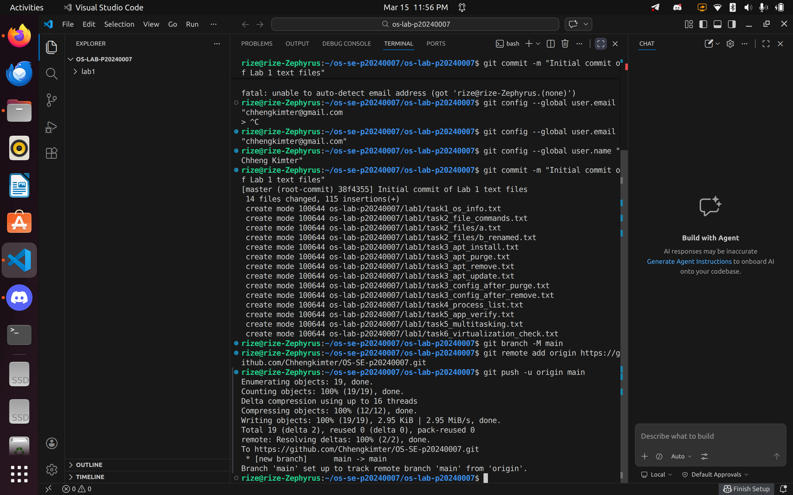