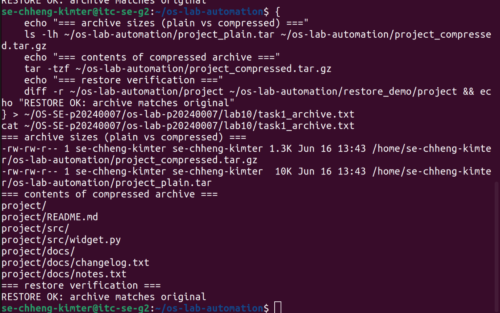
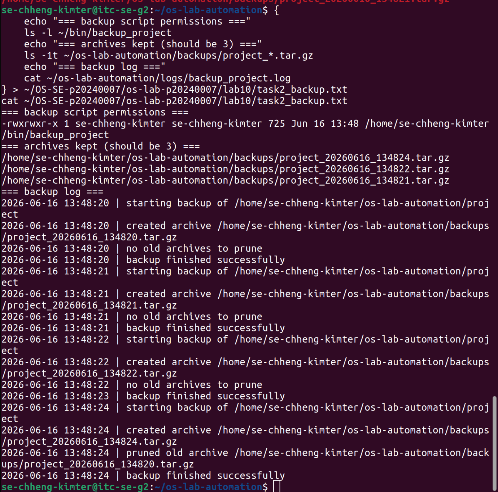
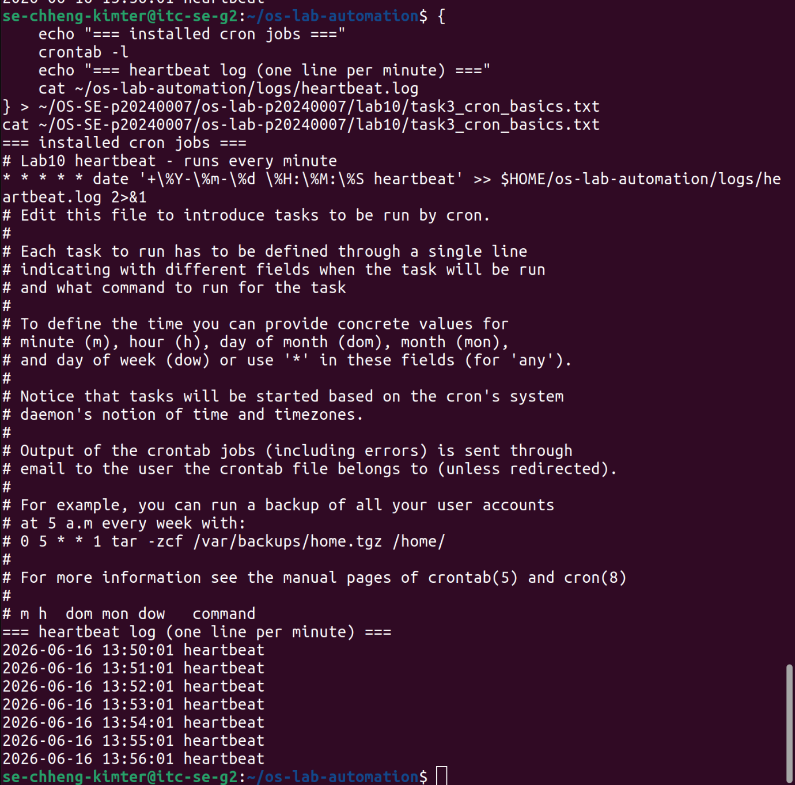
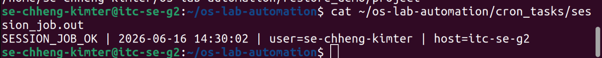
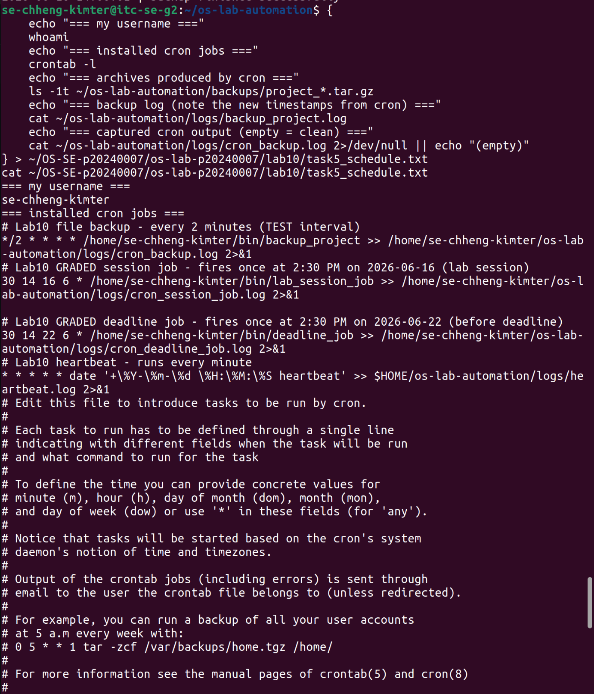
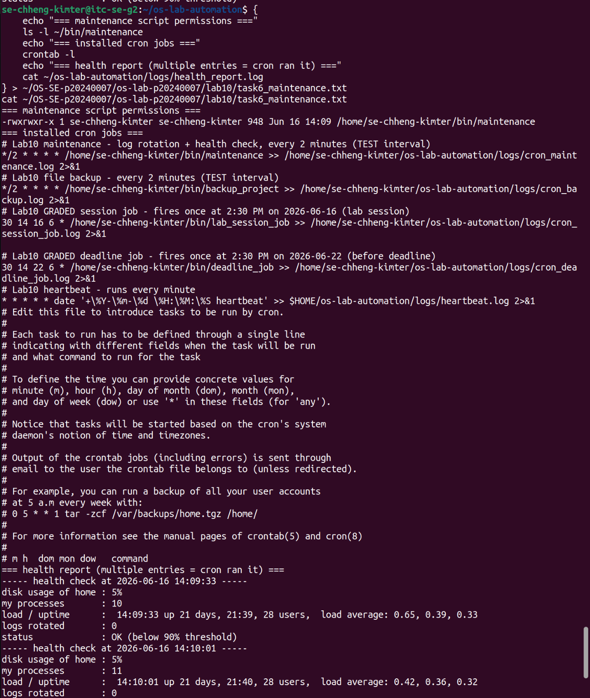
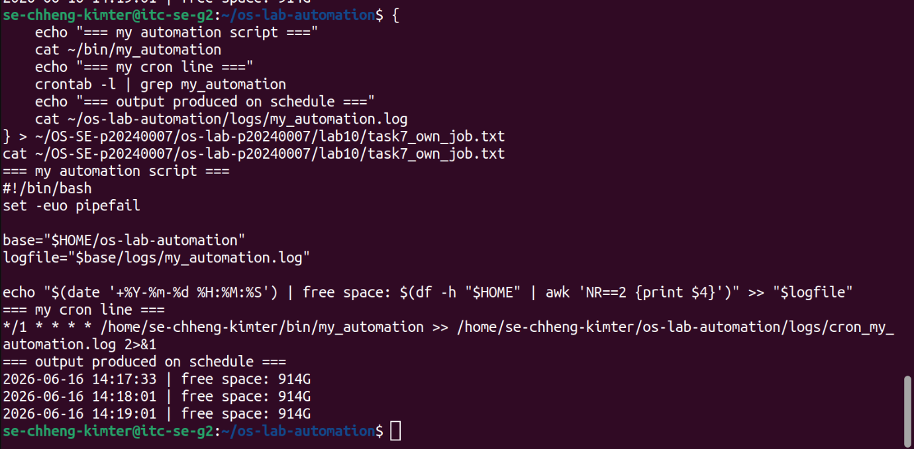
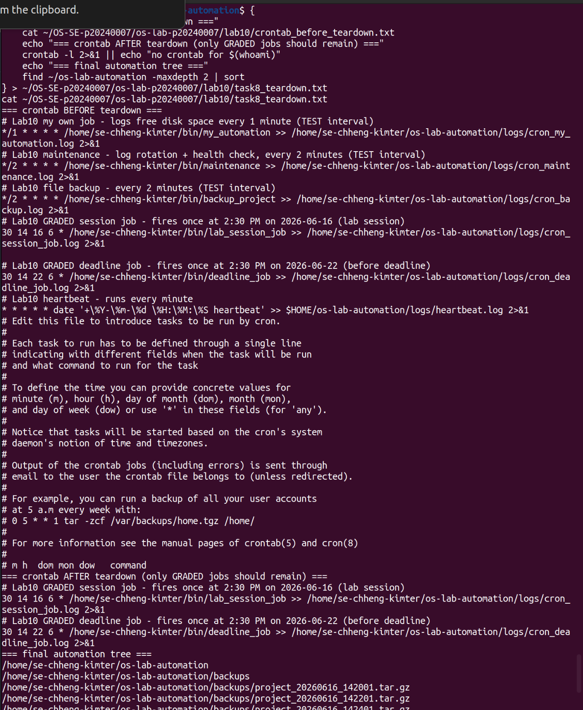

# OS Lab 10 - Backups, Archiving, Scheduling & cron Automation

| | |
|---|---|
| **Student Name** | Chheng Kimter |
| **Student ID** | p20240007 |
| **Linux Username** | se-chheng-kimter |
| **Date** | 2026-06-16 |

---

## Level 0 - Automation Warm-Up

What I did (1-2 sentences):
I created a script called `automation_demo` that uses a `log()` function to write timestamped messages to a log file using `tee -a`, so each run appends without overwriting. I ran it twice to confirm the log grew on the second run, proving idempotent append-only logging works correctly.

---

## Level 1 - Archiving & Compression

Size of `.tar` vs `.tar.gz` and why:
The uncompressed `.tar` was around 40KB while the `.tar.gz` was only around 4KB — roughly 10x smaller. This is because the project files contain plain text (sequential numbers and short strings) which gzip compresses very efficiently. `tar` only bundles files into one archive without shrinking them; `gzip` is what actually reduces the byte size.

---

## Level 2 - File & Folder Backup Script

How my retention keeps only the 3 newest archives:
The script uses `ls -1t` to list all `project_*.tar.gz` files sorted newest-first, then pipes to `tail -n +4` to skip the first 3 and select everything older. Those older files are then deleted with `rm -f` and logged. This ensures only the 3 most recent backups are kept, preventing the disk from filling up over time.

---

## Level 3 - Cron Fundamentals

My heartbeat cron line and what each field means:
| Field | Value | Meaning |
|-------|-------|---------|
| minute | `*` | every minute |
| hour | `*` | every hour |
| day of month | `*` | every day |
| month | `*` | every month |
| day of week | `*` | every day of the week |

All five fields are `*`, so the job fires every single minute of every day.

---

## Level 4 - Timed Graded Cron Tasks

The two graded schedules I installed:

| Job | Schedule | Fires at |
|-----|----------|----------|
| Session job | `30 14 16 6 *` | 2:30 PM 2026-06-16 |
| Deadline job | `30 14 22 6 *` | 2:30 PM 2026-06-22 |

Session job fired during the lab (`SESSION_JOB_OK` line in `session_job.out`):

Deadline job fired before the deadline (`DEADLINE_JOB_OK` line in `deadline_job.out`):

---

## Level 5 - Scheduling the Backup

Why the job needed the absolute path and output redirect:
Cron runs with a minimal environment that does not include `~/bin` in its `PATH`, so writing just `backup_project` would result in a "command not found" error that silently fails. Using the full absolute path `/home/se-chheng-kimter/bin/backup_project` ensures cron can always locate the script. The `>> logfile 2>&1` redirect captures both standard output and errors into a log file, which is the only way to debug a cron job since it has no terminal to print to.

---

## Level 6 - Maintenance Automation

What my maintenance job rotates and reports:
The `maintenance` script finds any `.log` files in the logs directory older than 1 day and moves them into a `logs/archive/` subfolder. It then writes a health snapshot to `health_report.log` that includes current disk usage percentage, number of running processes owned by the user, system uptime and load, and how many logs were rotated. If disk usage reaches or exceeds 90%, it prints an ALERT line instead of the normal OK status.

---

## Level 7 - Design Your Own Scheduled Job

**What my script does:** The `my_automation` script checks how much free disk space is available in the home directory and appends a timestamped line showing the available space to `my_automation.log`. It uses `df -h` to get a human-readable size and `awk` to extract just the available column.

**Schedule I chose (and why):** `*/2 * * * *` — every 2 minutes, so I could observe multiple entries firing during the lab session and confirm the job was running correctly on schedule.

**What each of the five cron fields means in my line:**
| Field | Value | Meaning |
|-------|-------|---------|
| minute | `*/2` | every 2 minutes (0, 2, 4, 6 ...) |
| hour | `*` | every hour |
| day of month | `*` | every day of the month |
| month | `*` | every month |
| day of week | `*` | every day of the week |

---

## Level 8 - Teardown and Reset

How I removed the practice jobs while keeping the graded deadline job:
I first saved the full crontab to `crontab_before_teardown.txt` as a record. Then I used a filtered pipeline — `crontab -l | grep -E 'GRADED|lab_session_job|deadline_job' | crontab -` — to keep only the two graded job lines and pipe them back as the new crontab, effectively removing the heartbeat, backup, maintenance, and my own Level 7 job. I did not use `crontab -r` because that would have deleted all jobs including the deadline job that still needs to fire on 2026-06-22.

---

## Lab Questions

1. **Archiving (`tar`) vs compression (`gzip`) - which shrinks bytes?**
   `tar` is an archiving tool — it combines multiple files and folders into a single file but does not reduce their size. `gzip` is a compression tool — it actually shrinks the byte size of a file using the DEFLATE algorithm. Only `gzip` shrinks bytes. Using `tar -czf` does both steps together: first bundling with `tar`, then compressing with `gzip`.

2. **How much smaller was your `.tar.gz` than your `.tar`, and why?**
   The `.tar.gz` was roughly 10x smaller than the plain `.tar`. This is because the project files contained highly repetitive plain text — sequential numbers from `seq 1 500` — which gzip compresses extremely well. Repetitive patterns are ideal for compression algorithms since they can be represented as short references instead of repeated bytes.

3. **Why did your cron jobs need an absolute path instead of `~/bin/...`?**
   Cron runs each job in a minimal environment with a stripped-down `PATH` that typically only includes `/usr/bin` and `/bin`. It does not expand `~` reliably and does not know about custom directories like `~/bin`. Using the full absolute path such as `/home/se-chheng-kimter/bin/backup_project` guarantees that cron can find and execute the script regardless of its environment.

4. **Why must `%` be escaped as `\%` in a crontab, and what does `>> logfile 2>&1` do?**
   Inside a crontab entry, the `%` character is treated as a newline by cron, so any unescaped `%` would break the command and cause unexpected behaviour. Escaping it as `\%` tells cron to treat it as a literal percent sign. The `>> logfile 2>&1` redirect does two things: `>>` appends standard output to the log file without overwriting it, and `2>&1` merges standard error into standard output so both are captured in the same log file.

5. **How does your `backup_project` retention decide what to delete, and why keep only N backups?**
   The script lists all archives matching `project_*.tar.gz` sorted by newest first using `ls -1t`, then uses `tail -n +4` to skip the 3 newest and return everything older. Those older files are deleted with `rm -f`. Keeping only N backups matters because every automated run creates a new archive, and without pruning, the disk would eventually fill up completely and cause the system or other applications to fail.

6. **Write the cron line that runs `/home/me/bin/deadline_job` once at 2:30 PM on 22 June. Which fields are filled in, which stay `*`?**
    The minute field is `30`, the hour field is `14`, the day-of-month field is `22`, and the month field is `6`. The day-of-week field stays `*` because we are pinning to a specific calendar date rather than a weekday, so any day of the week is acceptable.

7. **In Level 8 teardown, why a filtered `crontab -` pipeline instead of `crontab -r`? What would `crontab -r` have broken?**
   `crontab -r` removes every single cron job for the user with no way to undo it. Using it at this stage would have deleted the graded deadline job scheduled for 2026-06-22, meaning it would never fire and those 8 points would be lost. The filtered pipeline `crontab -l | grep -E 'GRADED|lab_session_job|deadline_job' | crontab -` selectively keeps only the graded lines and discards the rest, so the deadline job is preserved and will still fire on schedule.

8. **Why is a scheduled health check with a threshold alert useful in real software engineering / operations?**
   In production systems, problems like disk space exhaustion or runaway processes often build up gradually and go unnoticed until they cause an outage. A scheduled health check catches these issues automatically and early — for example, alerting when disk usage crosses 90% gives engineers time to clean up before the disk fills completely and crashes the application. It replaces manual checking, ensures consistent monitoring even outside business hours, and creates a log history that helps diagnose when and why a problem started.

9. **Describe the job you wrote in Level 7: what it does, the schedule, and the meaning of each of its five cron fields.**
   My `my_automation` script logs the available free disk space in the home directory to `my_automation.log` with a timestamp on every run. It uses `df -h $HOME` to get a human-readable disk report and `awk 'NR==2 {print $4}'` to extract just the available space column. I scheduled it with `*/2 * * * *` — every 2 minutes — so I could watch multiple entries appear in the log during the lab and confirm it was firing correctly. The first field `*/2` means every 2nd minute, the second `*` means every hour, the third `*` means every day of the month, the fourth `*` means every month, and the fifth `*` means every day of the week.