# OS Lab 3 Submission — Wildcards, Links, GRUB & Shared Libraries

- **Student Name:** Chheng Kimter
- **Student ID:** p20240007
- **Partner Name (Task 5):** Thai Monika
- **Partner ID (Task 5):** p20240055
---

## Task Output Files

During the lab, each task redirected its output into `.txt` files. These files are your primary proof of work for the **guided portions** of each task. Make sure all of the following files are present in your `lab3/` folder:

- [x] `task1_wildcards.txt`
- [x] `task2_links.txt`
- [x] `task3_grub.txt`
- [x] `task4_shared_objects.txt`
- [x] `task5_shared_library.txt`
- [x] `task_history.txt`

---

## Task 1 — Mastering Wildcards

**Environment:** Ubuntu (WSL)

In this task, I created a playground directory called `wildcard_lab/` containing files with various extensions — `.txt`, `.csv`, `.png`, `.jpg`, `.log`, `.yaml`, `.yml`, `.json`, `.tar.gz`, and `.tmp`. I then practised all four wildcard types:

- **Star (`*`):** Matched groups of files by extension or prefix, for example listing all `.txt` files or all files starting with `log_`.
- **Question mark (`?`):** Matched exactly one character, for example `data0?.csv` matched `data01.csv` through `data03.csv` but not `data10.csv`.
- **Square brackets (`[]`):** Matched a character set or range, for example `report0[1-3].txt` listed only reports 01 to 03, and `log_[jfm]*.log` listed months starting with j, f, or m.
- **Negated set (`[!...]`):** Excluded characters from matches, for example `log_[!j]*.log` listed all monthly log files except January.
- **Brace expansion (`{}`):** Generated multiple patterns in one command, for example `ls config.{yaml,yml}` listed both config files at once.
- **Wildcards with commands:** Copied all `.csv` files to a `csv_archive/` directory using `cp *.csv` and removed all `.tmp` files in a single `rm *.tmp` command.

### Challenge Answers

**1a.** I used `ls wildcard_lab/r*.txt` to list all `.txt` files whose names start with `r`. This matched `readme.txt`, `report01.txt`, `report02.txt`, `report03.txt`, and `report10.txt`.

**1b.** I used `ls wildcard_lab/image?.* ` to match files with exactly one character between `image` and the extension. This matched `image1.png`, `image2.png`, `image3.jpg`, and `image4.jpg`.

**1c.** I used `touch wildcard_lab/memo_{mon,tue,wed,thu,fri}.txt` to create five files in one command, then `ls wildcard_lab/memo_*.txt` to confirm all five were created.

**1d.** I used `rm wildcard_lab/*.log` to remove all `.log` files in one command, then listed the remaining files to confirm they were gone.

---

## Task 2 — Hard Links and Symbolic Links

**Environment:** Ubuntu (WSL)

In this task, I created a workspace called `links_lab/` and explored the difference between hard links and symbolic links using a config file.

**Hard links** share the same inode number as the original file. When I ran `ln config_original.txt config_hardlink.txt` and listed both with `ls -li`, both files showed the same inode number and a link count of 2. After modifying the original, the hard link reflected the change because they point to the same underlying data. After deleting the original with `rm config_original.txt`, the hard link **still worked** — the data persisted on disk because at least one link to the inode remained.

**Symbolic links** have their own separate inode and store the path to the target. After creating `config_symlink.txt` with `ln -s`, `ls -li` showed a different inode number and a `->` arrow pointing to the original. After the original was deleted, the symlink became **broken** (dangling) — reading it returned an error because the path it pointed to no longer existed.

I also created a symbolic link to a directory (`ln -s projects/frontend web_shortcut`) and confirmed I could browse its contents through the link. I then explored real-world symlinks in `/usr/bin/python*` and `/etc/alternatives/`.

### Challenge Answers

**2a.** I created `shared_data.txt` with `echo "Shared resource across departments" > links_lab/shared_data.txt`, then created two hard links with `ln links_lab/shared_data.txt links_lab/hr_data.txt` and `ln links_lab/shared_data.txt links_lab/eng_data.txt`. Running `ls -li` showed all three files sharing the same inode number with a link count of 3.

**2b.** I created a symlink in `lab3/` pointing to `links_lab/projects/frontend/` with `ln -s links_lab/projects/frontend quick_access`. Running `ls quick_access/` showed `index.html`, confirming the link worked.

**2c.** After deleting `shared_data.txt`, both `hr_data.txt` and `eng_data.txt` were still readable because they are hard links — the data remains as long as at least one hard link exists. Running `ls -li` showed the link count drop from 3 to 2.

---

## Task 3 — GRUB: Exploration, Customization & Boot Recovery

**Environment:** Ubuntu 24.04 VM, kernel `6.14.0-27-generic`

### Part A — Bootloader Exploration

I examined the full GRUB setup on the VM. Key findings:

- The running kernel version was `6.14.0-27-generic`.
- `/boot/grub/grub.cfg` is auto-generated and should never be edited directly.
- `/etc/default/grub` is the file administrators edit to change boot behaviour. Key settings include `GRUB_DEFAULT` (which entry boots by default), `GRUB_TIMEOUT` (seconds before auto-boot), and `GRUB_CMDLINE_LINUX_DEFAULT` (kernel parameters for normal boot).
- The boot directory contained the kernel image (`vmlinuz`) and initial ramdisk (`initrd.img`), which is a temporary root filesystem loaded into memory before the real root filesystem is available.
- The `dmesg` output showed early kernel boot messages including hardware detection.
- The `/etc/grub.d/` directory contains numbered scripts (e.g., `10_linux`, `30_os-prober`) that are combined by `update-grub` to build the final `grub.cfg`.

### Part B — GRUB Customization

I made three customizations to the VM's GRUB configuration:

1. **Timeout:** Changed `GRUB_TIMEOUT` to `10` so the menu stays visible for 10 seconds before auto-booting.
2. **Boot messages:** Cleared `GRUB_CMDLINE_LINUX_DEFAULT` (removed `quiet splash`) so kernel boot messages are visible during startup.
3. **Custom menu entry:** Created `/etc/grub.d/40_custom_techcorp` with a new menu entry titled `"TechCorp Training VM — Boot Standard"`, made it executable, and ran `sudo update-grub`. The entry appeared in the GRUB menu on the next reboot.
4. **Background image:** Created a custom 640×480 PNG image using ImageMagick with the text "TechCorp Server" on a dark background, copied it to `/boot/grub/grub_bg.png`, and added `GRUB_BACKGROUND="/boot/grub/grub_bg.png"` to `/etc/default/grub`. After running `sudo update-grub` and rebooting, the custom background appeared behind the GRUB menu.

### Part C — Boot Break & Recovery

I simulated a GRUB failure and recovered from it manually:

1. **Snapshot:** Took a VM snapshot named "Before Boot Lab" before making any changes.
2. **Boot Recovery Mode:** Accessed the GRUB Advanced Options menu and booted into Recovery Mode. In the root shell, I verified the system status with `whoami` (returned `root`), `mount | grep "on / "`, and `uname -r`.
3. **Breaking GRUB:** Backed up `grub.cfg` then renamed it to `grub.cfg.broken` and rebooted. The system dropped to the `grub>` command line prompt because GRUB could not find its configuration.
4. **Manual boot:** At the `grub>` prompt, I used `ls` to find the correct partition, then manually booted with `set root`, `linux`, `initrd`, and `boot` commands.
5. **Restoration:** After booting into the system, I ran `sudo mv /boot/grub/grub.cfg.broken /boot/grub/grub.cfg` and then `sudo update-grub` to fully restore the configuration. The system booted normally afterward.

Boot recovery was confirmed on **Wed Apr 1 2026** at 17:12. Kernel was `6.14.0-27-generic` and uptime was 4 minutes after recovery.

### Challenge Answers

**3a.** I changed `GRUB_DEFAULT=0` to `GRUB_DEFAULT=1` in `/etc/default/grub`, ran `sudo update-grub`, and rebooted. The second menu entry (the first entry in "Advanced options") was highlighted by default instead of the main Ubuntu entry.

**3b.** I added the following lines to `/etc/default/grub`:
```
GRUB_COLOR_NORMAL="light-gray/black"
GRUB_COLOR_HIGHLIGHT="yellow/blue"
```
After running `sudo update-grub` and rebooting, the GRUB menu displayed light gray text on a black background, with the selected entry highlighted in yellow on blue.

**3c.** I searched for the root partition UUID inside `/boot/grub/grub.cfg` using:
```bash
grep "search --no-floppy --fs-uuid" /boot/grub/grub.cfg
```
The root partition UUID is `2c30ef1c-5d48-48a1-b377-0b91b43c6b68`. GRUB uses this UUID with the `search --fs-uuid --set=root` command to locate the correct partition to boot from, regardless of which device name (`/dev/sda`, `/dev/sdb`, etc.) the disk is assigned at boot time. Using a UUID is more reliable than using device names, which can change between boots.

---

## Task 4 — Shared Objects (Dynamic Libraries) Exploration

**Environment:** Ubuntu (WSL)

In this task, I investigated how Linux programs use shared libraries at runtime.

**Key findings from `ldd`:**
- `/bin/ls` depends on 4 shared libraries: `linux-vdso.so.1`, `libselinux.so.1`, `libc.so.6`, and `libpcre2-8.so.0`, plus the dynamic linker `ld-linux-x86-64.so.2`.
- `/bin/bash` depends on `libtinfo.so.6` and `libc.so.6`.
- `/usr/bin/grep` depends on `libpcre2-8.so.0` and `libc.so.6`.

`libc.so.6` is present in all three — it is the core C standard library that almost every Linux program depends on.

**Library cache:** The system has **867** shared libraries registered in the cache (`ldconfig -p`). The dynamic linker searches `LD_LIBRARY_PATH` first, then the cache, then default paths (`/lib`, `/usr/lib`).

**Dynamic linker config:** `/etc/ld.so.conf` uses `include /etc/ld.so.conf.d/*.conf` to load search paths. The active paths are `/usr/local/lib`, `/usr/local/lib/x86_64-linux-gnu`, `/lib/x86_64-linux-gnu`, and `/usr/lib/x86_64-linux-gnu`.

**`/bin/ls` is dynamically linked** — confirmed by `file` showing "dynamically linked, interpreter /lib64/ld-linux-x86-64.so.2".

**Memory mapping:** The current shell process loads `ld-linux-x86-64.so.2`, `libc.so.6`, and `libtinfo.so.6.4` into memory.

### Challenge Answers

**4a.** `/usr/bin/ssh` depends on **13 shared libraries**: `linux-vdso.so.1`, `libselinux.so.1`, `libgssapi_krb5.so.2`, `libcrypto.so.3`, `libz.so.1`, `libc.so.6`, `libpcre2-8.so.0`, `ld-linux-x86-64.so.2`, `libkrb5.so.3`, `libk5crypto.so.3`, `libcom_err.so.2`, `libkrb5support.so.0`, `libkeyutils.so.1`, and `libresolv.so.2`. SSH needs significantly more libraries than `ls` because it handles cryptography (Kerberos, OpenSSL) and network operations.

**4b.** Using `ls /lib/x86_64-linux-gnu/libm*`, I found math-related and other libraries starting with `libm`, including `libm.so.6` (the main math library), `libm17n` (multilingual text processing), `libmagic.so.1`, `libmount.so.1`, and many others.

**4c.** Running `readlink -f /lib/x86_64-linux-gnu/libc.so.6` resolved to `/usr/lib/x86_64-linux-gnu/libc.so.6`. Yes, `libc.so.6` is itself a symbolic link — it points to the actual versioned library file. This allows the system to update the library without breaking programs that reference `libc.so.6` by name.

**4d.** I compiled a minimal C program with `gcc /tmp/test_link.c -o /tmp/test_link`. Running `ldd /tmp/test_link` showed it depends on only `libc.so.6` and `ld-linux-x86-64.so.2` — even an empty `main()` function requires the C standard library and the dynamic linker to run.

---

## Task 5 — Build & Register a Shared Library (Pair Task)

**Environment:** Ubuntu (WSL)

**My role:** Role B — Test Author → v2 Library Extender

### Phase 1 — API Design

My partner and I designed the `libtechcorp_sysinfo` library API together by agreeing on the header file `techcorp_sysinfo.h`. The initial API defined three functions:
- `tc_get_hostname()` — returns the machine hostname
- `tc_get_uptime()` — returns system uptime as a human-readable string
- `tc_get_cpu_count()` — returns the number of CPU cores

### Phase 2 — Divide & Build

As **Role B**, I wrote `sysinfo_test.c` — the test program that calls all three API functions and prints a formatted system info report. I wrote this using only the header file, without seeing Partner A's implementation.

### Phase 3 — Integration

Partner A shared their compiled `libtechcorp_sysinfo.so` with me. I compiled the test program with:
```bash
gcc sysinfo_test.c -L. -ltechcorp_sysinfo -o sysinfo_test
LD_LIBRARY_PATH=. ./sysinfo_test
```
The program ran successfully and printed the hostname, uptime, and CPU core count.

### Phase 4 — Role Swap

Both partners updated `techcorp_sysinfo.h` to add a new function `tc_get_memory_mb()` that returns total RAM in MB.

As **Role B** (now Library Extender), I implemented the new function in `techcorp_memory.c`, reading from `/proc/meminfo` to get the total memory in kilobytes and converting it to megabytes. I then recompiled the full library combining both `.c` files:
```bash
gcc -fPIC -c techcorp_sysinfo.c -o techcorp_sysinfo.o
gcc -fPIC -c techcorp_memory.c -o techcorp_memory.o
gcc -shared -o libtechcorp_sysinfo.so techcorp_sysinfo.o techcorp_memory.o
```

Partner A (now Tester) wrote `sysinfo_test_v2.c` using only the updated header. After sharing the new `.so`, we compiled and ran the v2 test successfully.

### Phase 5 — System-Wide Installation

I installed the library system-wide:
```bash
sudo cp libtechcorp_sysinfo.so /usr/local/lib/
sudo ldconfig
```
After installation, `ldconfig -p | grep techcorp` confirmed the library was registered in the cache. Running `./sysinfo_test_v2` without `LD_LIBRARY_PATH` worked correctly, confirming the library was properly installed and discoverable by the dynamic linker.

**Key concept learned:** The `-fPIC` flag (Position-Independent Code) is required for shared libraries so the compiled code can be loaded at any memory address, since multiple programs may load the library at different addresses simultaneously.

---

## Screenshots

The screenshots below document the **Challenge sections**, **VM tasks**, **pair task**, and **command history**.

---

### Screenshot 1 — Task 1 Challenge: Wildcards

Show the terminal where you ran your wildcard challenge commands **1a–1d** (listing files with `r*`, single-character match with `?`, brace expansion for `memo_` files, and removing `.log` files). This should show both the commands you typed and their output.

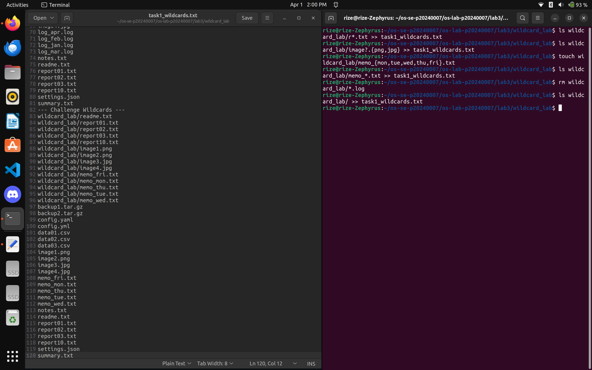

---

### Screenshot 2 — Task 2 Challenge: Links

Show the terminal where you ran your link challenge commands **2a–2c** (creating hard links to `shared_data.txt`, creating a symlink to a directory, and testing what happens when the original is deleted). Show the inode numbers and link counts.

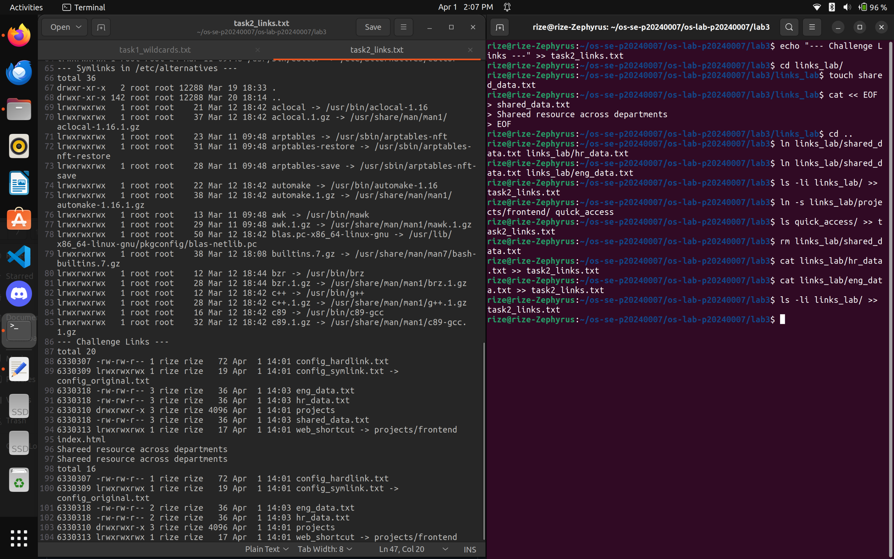

---

### Screenshot 3 — Task 3 Part B: VM Snapshot

Show your VM's snapshot panel confirming the "Before Boot Lab" snapshot was created before starting any VM changes.

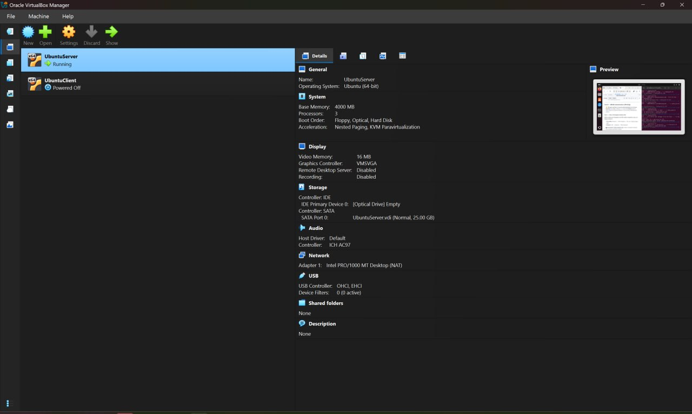

---

### Screenshot 4 — Task 3 Part B: GRUB Timeout Config

Show the modified `/etc/default/grub` with `GRUB_TIMEOUT=10` and the cleared `GRUB_CMDLINE_LINUX_DEFAULT`.

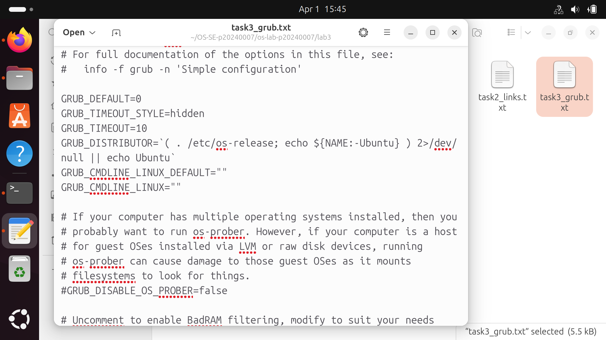

---

### Screenshot 5 — Task 3 Part B: Custom GRUB Entry

Show the GRUB menu displaying the custom "TechCorp Training VM — Boot Standard" entry.

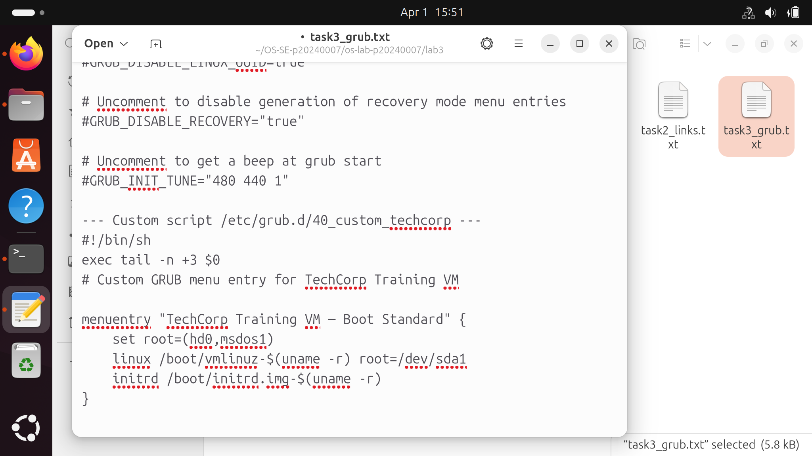

---

### Screenshot 6 — Task 3 Part B: GRUB Background Image

Show the GRUB menu with the custom background image (created using ImageMagick, "TechCorp Server" text on a dark background) visible behind the menu text.

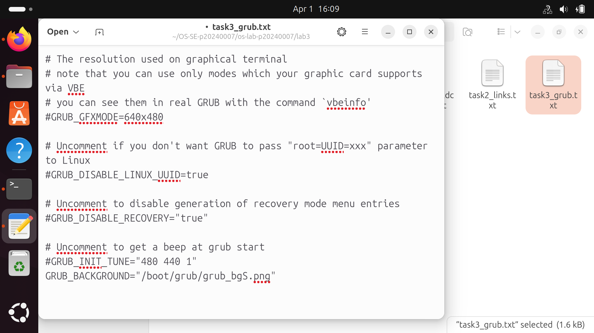

---

### Screenshot 7 — Task 3 Part C: Recovery Mode

Show the GRUB advanced options and the recovery root shell with the output of `whoami`, `mount | grep "on / "`, and `uname -r`.

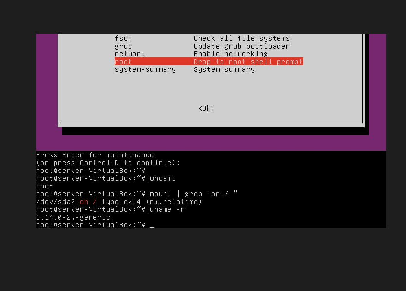

---

### Screenshot 8 — Task 3 Part C: Broken GRUB

Show the `grub>` command line prompt that appeared after `grub.cfg` was renamed to `grub.cfg.broken`.

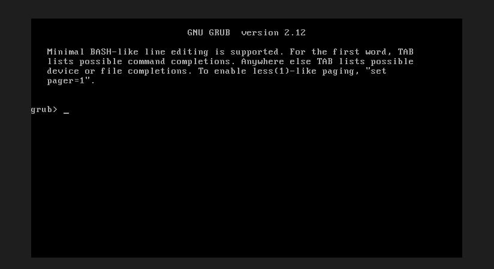

---

### Screenshot 9 — Task 3 Part C: Manual Boot

Show the manual GRUB commands typed at the `grub>` prompt (`set root`, `linux`, `initrd`, `boot`) and the system beginning to start up.

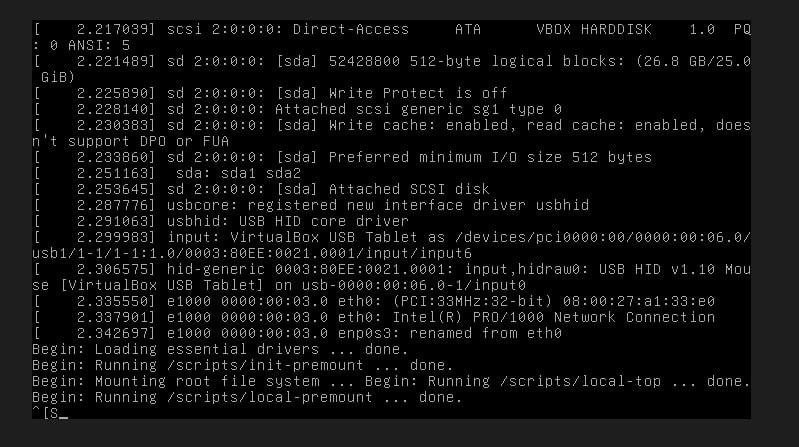

---

### Screenshot 10 — Task 3 Part C: Restored & Normal Boot

Show the output of `ls -la /boot/grub/grub.cfg` and `head -5 /boot/grub/grub.cfg` confirming the configuration was restored, plus `uname -r` (`6.14.0-27-generic`) and `uptime` after normal boot on April 1, 2026.

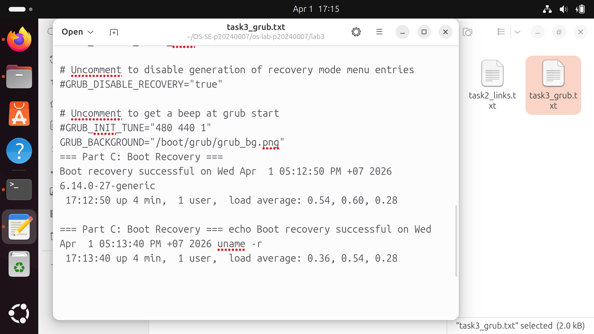

---

### Screenshot 11 — Task 3 Challenge: GRUB Customization

Show the GRUB menu with the custom color scheme (`light-gray/black` normal, `yellow/blue` highlight) and the `grep` output showing the root partition UUID `2c30ef1c-5d48-48a1-b377-0b91b43c6b68`.

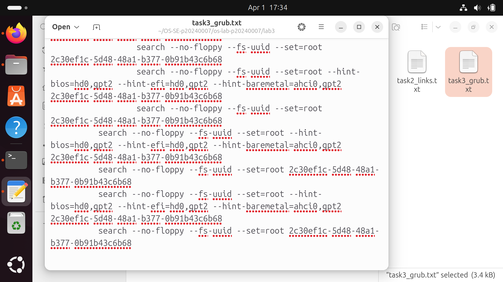

---

### Screenshot 12 — Task 4 Challenge: Shared Objects

Show the terminal where challenge commands 4a–4d were run: inspecting `/usr/bin/ssh` libraries (13 dependencies), listing `libm*` files, following the `libc.so.6` symlink chain to `/usr/lib/x86_64-linux-gnu/libc.so.6`, and the `ldd` output for the compiled test program.

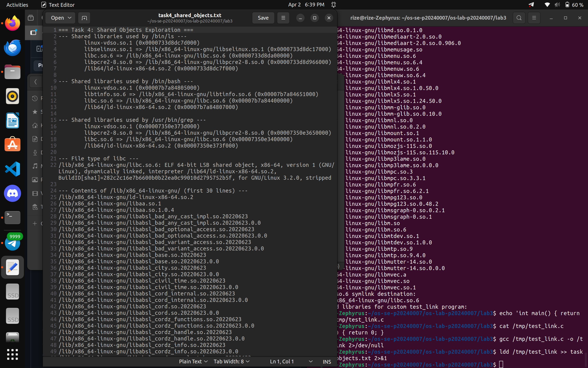

---

### Screenshot 13 — Task 5: Pair API Design

Show both partners' screens with the agreed `techcorp_sysinfo.h` header file open, proving the API was designed collaboratively.

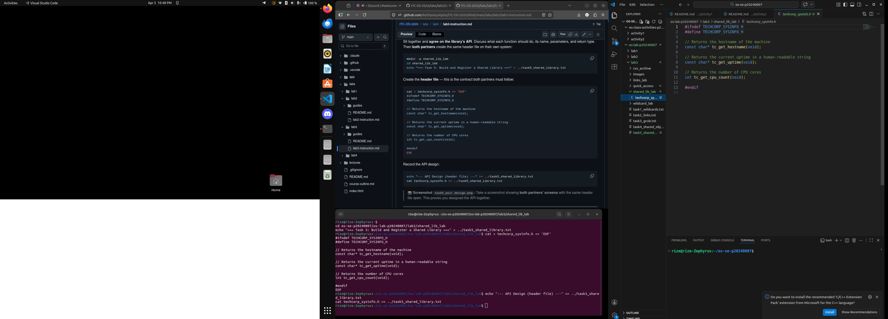

---

### Screenshot 14 — Task 5: Pair Integration Test

Show the final integration test: `ldconfig -p | grep techcorp` showing the library is registered, `ldd ./sysinfo_test_v2` showing it resolves to `/usr/local/lib/libtechcorp_sysinfo.so`, and the v2 test program output displaying hostname, uptime, CPU cores, and memory in MB.

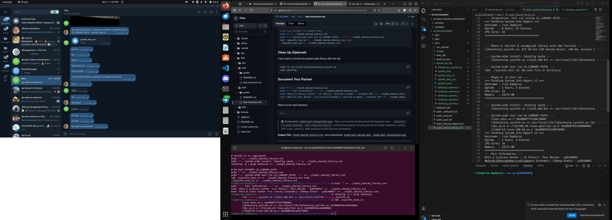

---

### Screenshot 15 — Full Command History

Output of `history | tail -n 100` at the end of the lab showing all commands used across all tasks.

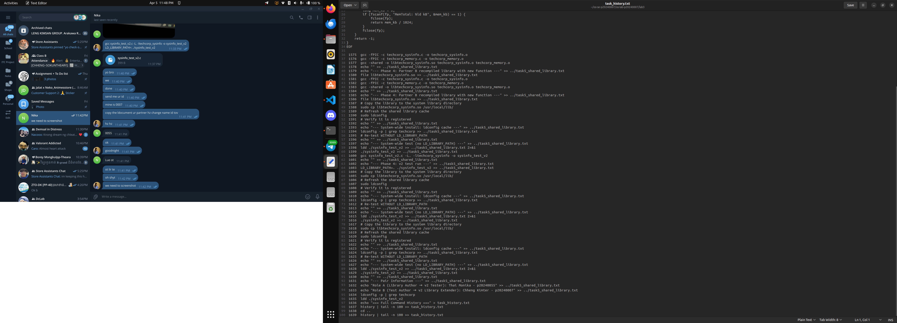