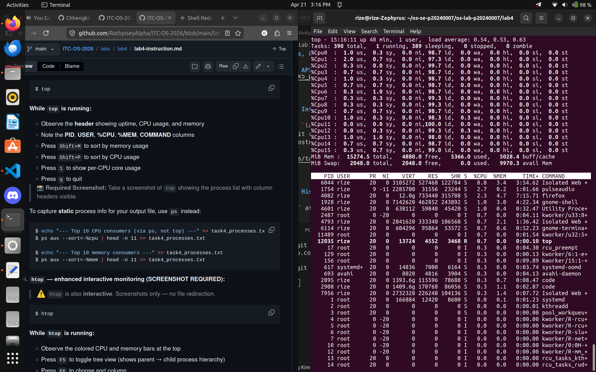
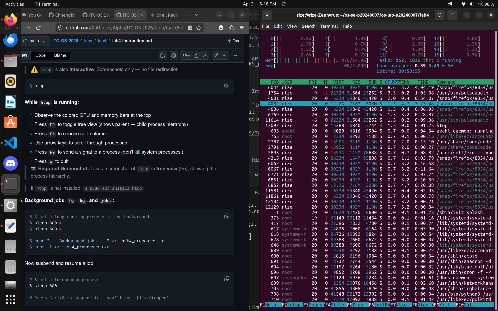
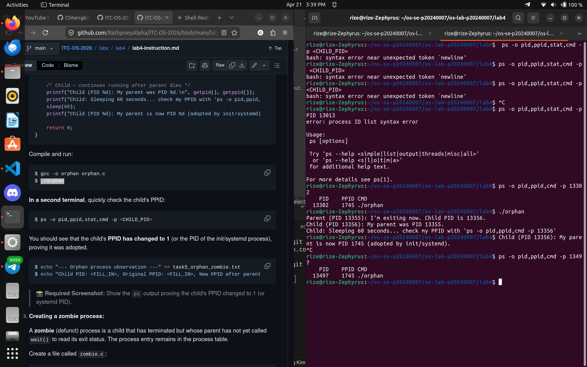
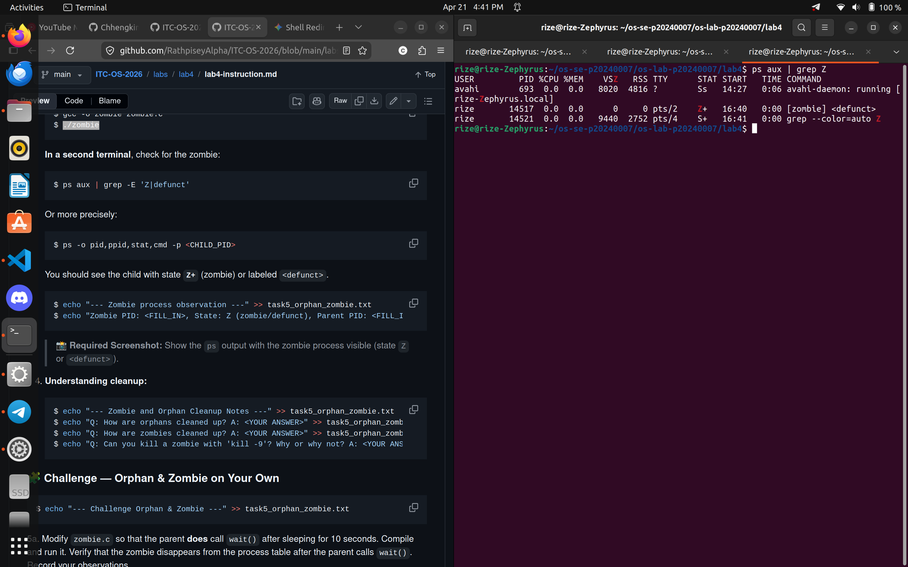

# Lab 4 — I/O Redirection, Pipelines & Process Management

| | |
|---|---|
| **Student Name** | `Chheng Kimter` |
| **Student ID** | `p20240007` |

## Task Completion

| Task | Output File | Status |
|------|-----------|--------|
| Task 1: I/O Redirection | `task1_redirection.txt` | ☐ |
| Task 2: Pipelines & Filters | `task2_pipelines.txt` | ☐ |
| Task 3: Data Analysis | `task3_analysis.txt` | ☐ |
| Task 4: Process Management | `task4_processes.txt` | ☐ |
| Task 5: Orphan & Zombie | `task5_orphan_zombie.txt` | ☐ |

## Screenshots

### Task 4 — `top` Output

### Task 4 — `htop` Tree View

### Task 5 — Orphan Process (`ps` showing PPID = 1)

### Task 5 — Zombie Process (`ps` showing state Z)

## Answers to Task 5 Questions

1. **How are orphans cleaned up?**
   > Orphans are adopted by a "subreaper" process, which is typically PID 1 (systemd or init). This process takes over the responsibility of monitoring the orphan and automatically reaps its exit status when it finally finishes, preventing it from remaining in the system indefinitely.

2. **How are zombies cleaned up?**
   > Zombies are cleaned up when their parent process executes a wait() or waitpid() system call. This action "reaps" the child's termination information from the process table, allowing the kernel to fully release the process's entry and PID.

3. **Can you kill a zombie with `kill -9`? Why or why not?**
   > No, you cannot kill a zombie with kill -9 because a zombie is already dead. It has no active code or memory; it is merely an entry in the process table. To remove it, you must either trigger the parent to call wait() or terminate the parent process entirely so the child is re-parented to PID 1 and cleaned up.

## Reflection

> The most useful technique was mastering the pipeline workflow (|), specifically combining grep, awk, and sort. Seeing how raw, messy data like access.log can be transformed into a specific list of IPs or a summary of status codes in a single line of code is a massive efficiency boost compared to manual searching.
In a production environment, these techniques are essential for log rotation and security auditing. For example, I could set up a cron job that uses grep to find failed login attempts in /var/log/auth.log, use awk to extract the offending IPs, and redirect that list into a firewall blacklist or an alert file. It’s also useful for automated backups, where I can pipe a database export through a compression tool like gzip and redirect the output directly to a storage volume, saving disk space and time.