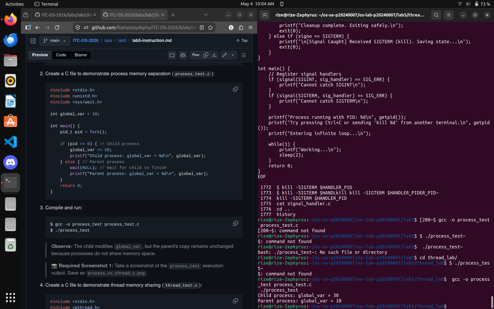
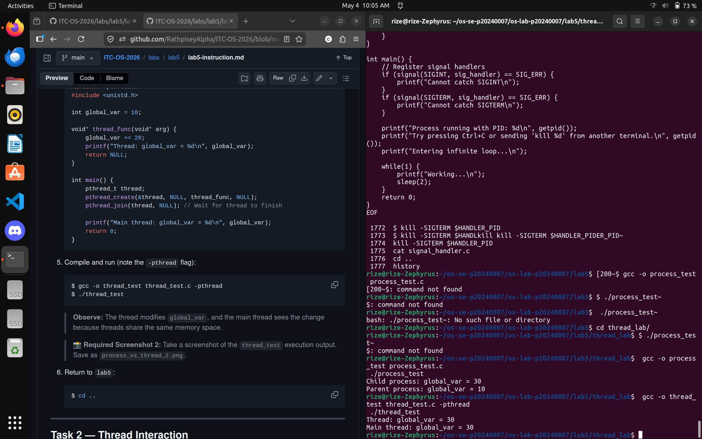
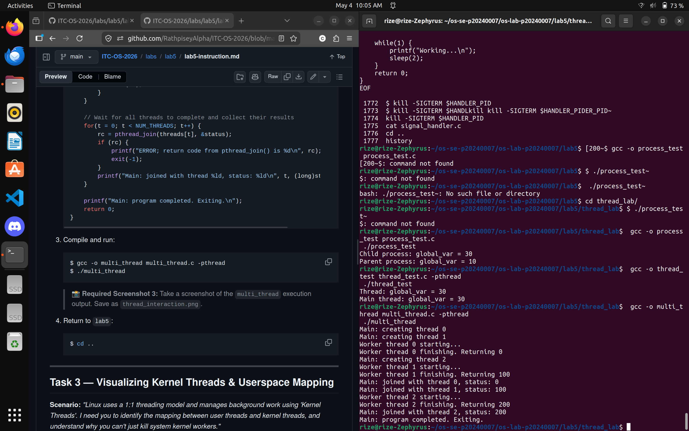
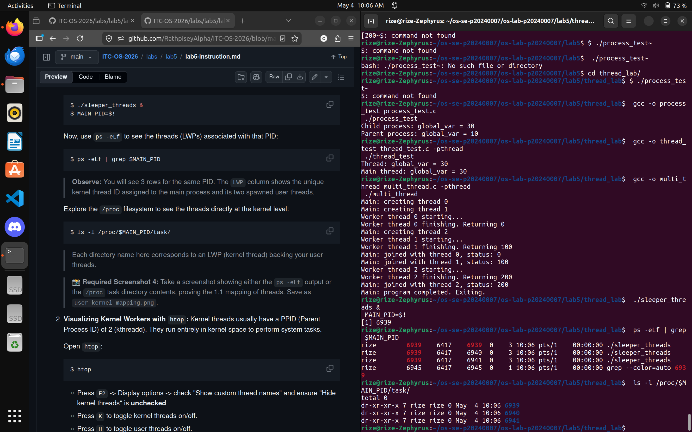
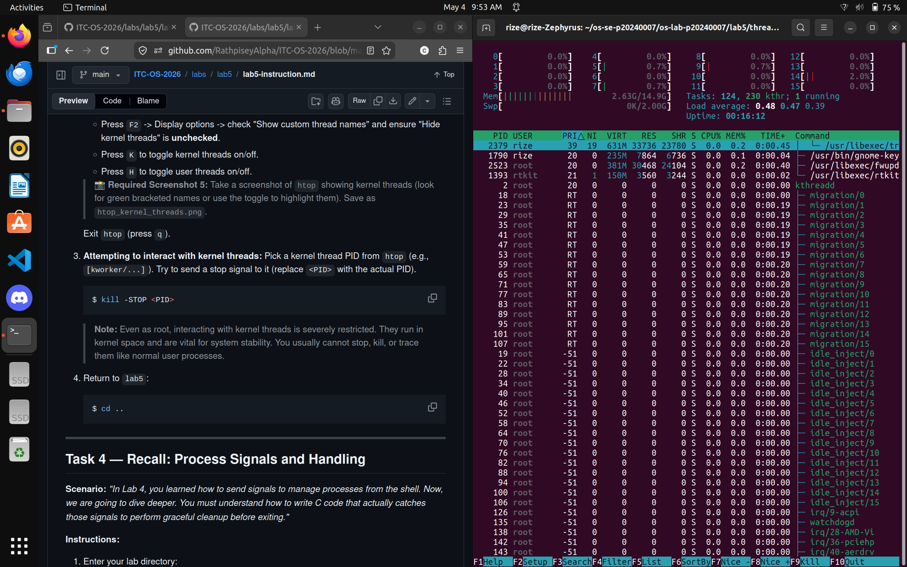
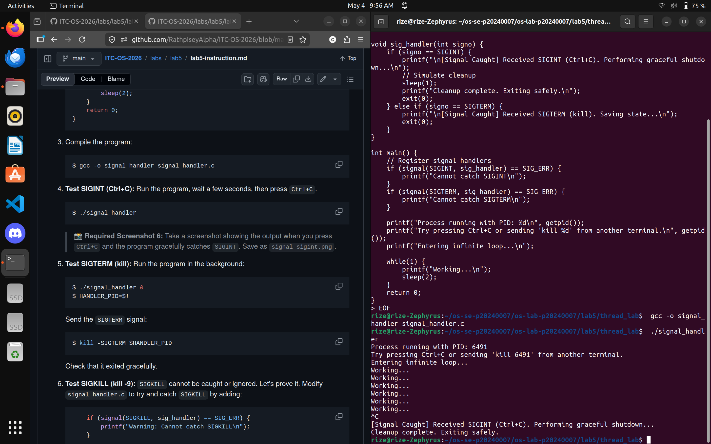
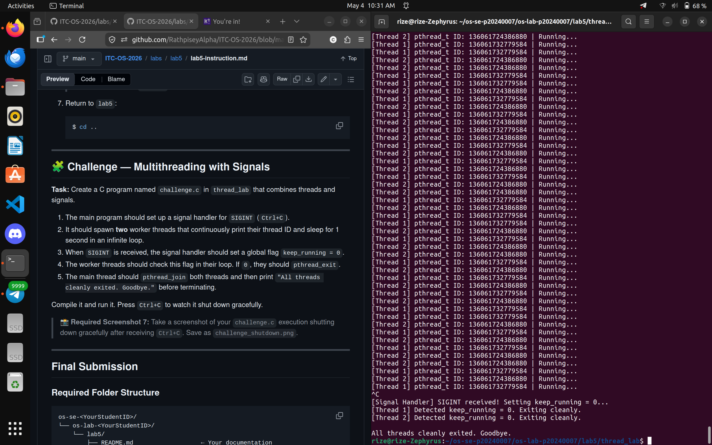

# OS Lab 5 Submission — Threads, Kernel Workers & Process Signals

- **Student Name:** [Your Name Here]
- **Student ID:** [Your Student ID Here]

---

## Task Output Source Files

Make sure all of the following files are present in your `lab5/thread_lab/` folder:

- [ ] `process_test.c`
- [ ] `thread_test.c`
- [ ] `multi_thread.c`
- [ ] `sleeper_threads.c`
- [ ] `signal_handler.c`
- [ ] `challenge.c`

---

## Screenshots

Insert your screenshots below.

### Screenshot 1 — Task 1: Process vs Thread (Process Test)
Show the output of `process_test.c`.
<!-- Insert your screenshot below: -->

---

### Screenshot 2 — Task 1: Process vs Thread (Thread Test)
Show the output of `thread_test.c`.
<!-- Insert your screenshot below: -->

---

### Screenshot 3 — Task 2: Thread Interaction
Show the output of `multi_thread.c`.
<!-- Insert your screenshot below: -->

---

### Screenshot 4 — Task 3: Visualizing 1:1 Thread Mapping
Show the `ps -eLf` output or `/proc/[pid]/task/` directory visualizing the LWP mapping for user threads.
<!-- Insert your screenshot below: -->

---

### Screenshot 5 — Task 3: `htop` Kernel Threads
Show `htop` visualizing kernel threads (usually bracketed names like `[kworker]`).
<!-- Insert your screenshot below: -->

---

### Screenshot 6 — Task 4: Catching `SIGINT`
Show the output of your `signal_handler` program gracefully catching `Ctrl+C`.
<!-- Insert your screenshot below: -->

---

### Screenshot 7 — Challenge: Graceful Multithreaded Shutdown
Show the output of your `challenge.c` program joining its threads and exiting gracefully after receiving `Ctrl+C`.
<!-- Insert your screenshot below: -->

---

## Answers to Lab Questions

1. **Why do threads share memory while processes do not (by default)?**
   > Threads share memory because they exist within the same process. When a program creates a thread using `pthread_create`, the new thread is given its own stack but shares the same heap, global variables, and code segment as the parent thread. This is by design — threads are meant to be lightweight units of execution that cooperate within one program, so sharing memory makes communication between them fast and direct. Processes, on the other hand, are created with `fork()`, which gives the child its own separate copy of the parent's address space. The operating system isolates processes from each other for safety and stability, so a crash or memory error in one process cannot corrupt another. This isolation is the fundamental trade-off: threads are faster to create and communicate but riskier (a bad pointer in one thread can crash the whole process), while processes are safer but heavier to create and require explicit mechanisms like pipes or shared memory to communicate.

2. **Based on the 1:1 mapping, what is the role of an LWP (Lightweight Process) in Linux?**
   > In Linux, every user-space thread created with `pthread_create` is backed by a corresponding kernel-level entity called a Lightweight Process (LWP). This is the 1:1 threading model — one user thread maps directly to one LWP, which the kernel schedules on the CPU just like a regular process. The LWP is what makes the thread visible to the kernel scheduler, meaning each thread can be assigned to a different CPU core and run truly in parallel on multi-core systems. You can observe this with `ps -eLf`, where the LWP column shows a unique ID for each thread within a process, distinct from the process's PID. Without this mapping, the kernel would have no way to independently schedule individual threads, and all threads in a program would have to time-share a single CPU slot.

3. **Why is it restricted to send signals to kernel threads (e.g., `kthreadd` or `kworker`)?**
   > Kernel threads like `kthreadd` and `kworker` run entirely in kernel space and are managed directly by the operating system. They do not have a user-space signal handler, so sending them a signal like `SIGTERM` or `SIGKILL` from user space has no meaningful effect — the kernel simply ignores it for most signals. More importantly, these threads perform critical system tasks such as managing other kernel threads, handling hardware work queues, and processing deferred I/O. Allowing arbitrary user processes to send disruptive signals to them could destabilize or crash the entire system. Linux therefore restricts signal delivery to kernel threads by design, and most attempts to `kill` them will either be silently ignored or require root privileges and still have no effect.

4. **Why can't `SIGKILL` (kill -9) be caught by a signal handler?**
   > `SIGKILL` is handled entirely by the kernel, not by the process receiving it. When `SIGKILL` is sent, the kernel immediately terminates the target process without ever delivering the signal to user space. This means there is no opportunity for the process to run any signal handler, perform cleanup, flush buffers, or close files — the kernel simply destroys the process outright. This is intentional: `SIGKILL` exists as a last-resort, guaranteed termination mechanism. If processes were allowed to catch and ignore `SIGKILL`, a misbehaving or malicious program could become impossible to stop. By keeping it unblockable and uncatchable at the kernel level, the operating system always retains the ability to forcibly end any process regardless of its state.

---

## Reflection

> _What was the most challenging part of managing threads and signals in this lab? How do you think these concepts apply to large-scale applications like web servers or databases?_
> The most challenging part of this lab was correctly handling signals in a multithreaded environment, particularly in the challenge program where `SIGINT` needed to trigger a graceful shutdown across multiple running threads. The difficulty was that signals in Linux are delivered to the process, not to a specific thread, so without careful design — such as using a flag variable and `pthread_join` — threads could be left running or abruptly interrupted mid-execution, causing undefined behavior or resource leaks. Getting every thread to notice the shutdown signal, finish its work cleanly, and allow the main thread to join it required thinking carefully about synchronization in a way that single-threaded signal handling does not.

> These concepts are directly relevant to large-scale applications. A web server like Nginx or Apache creates a pool of worker threads to handle incoming requests concurrently, and when the server receives a shutdown signal it must wait for in-flight requests to complete rather than dropping them instantly. Databases like PostgreSQL face the same challenge — threads managing active transactions must be allowed to commit or roll back cleanly before the process exits, otherwise data corruption can occur. Understanding how to design threads that respond to signals gracefully, and knowing the difference between signals the program can handle versus ones like `SIGKILL` that it cannot, is fundamental to building reliable software that can be safely started, stopped, and restarted in production.
