# OS Lab 6 Submission — Linux Security, Users, Groups & File Permissions
- **Student Name:** Chheng Kimter
- **Student ID:** p20240007

---

## Task Output Files

Make sure all of the following files are present in your `lab6/` folder:

- [x] `task1_users.txt`
- [x] `task2_groups.txt`
- [x] `task3_permissions.txt`
- [x] `task3_stat_output.txt`
- [x] `task4_special_bits.txt`
- [x] `task5_acl.txt`
- [x] `security_lab/whoami_suid.c`

---

## Screenshots

Insert your screenshots below.

### Screenshot 1 — Task 1: User Creation
Show `cat task1_users.txt` confirming both `dev_alice` and `dev_bob` accounts exist.

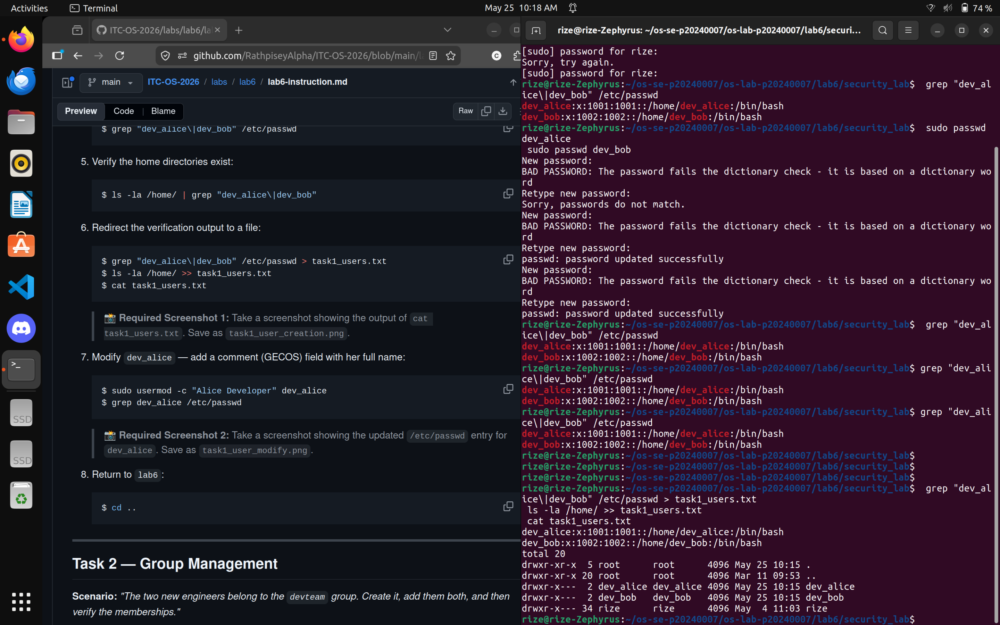

---

### Screenshot 2 — Task 1: User Modification
Show the updated `/etc/passwd` entry for `dev_alice` with the GECOS comment field.

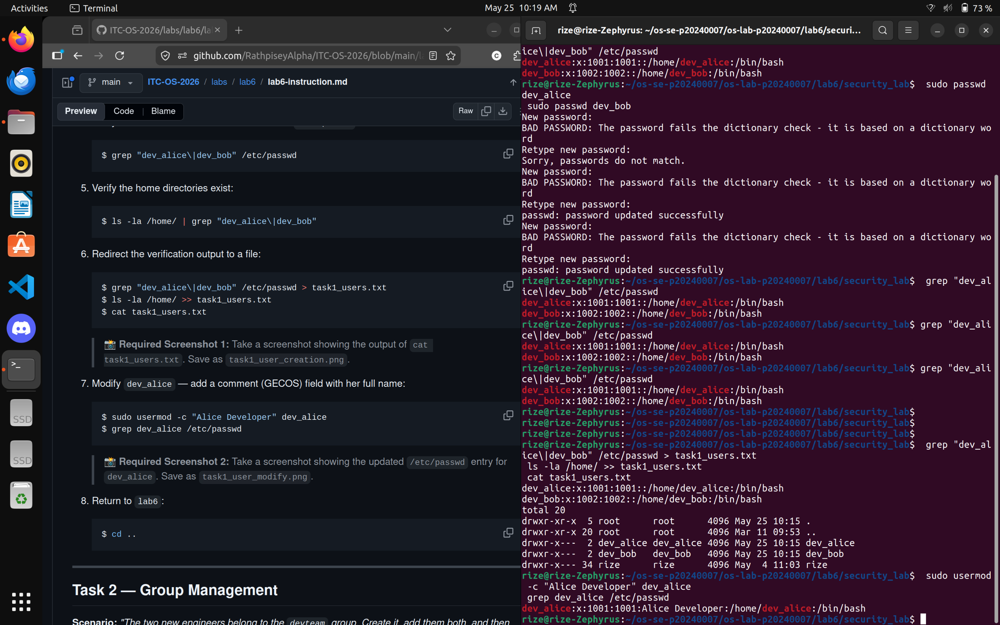

---

### Screenshot 3 — Task 2: Group Setup
Show `cat task2_groups.txt` with group membership for both users.

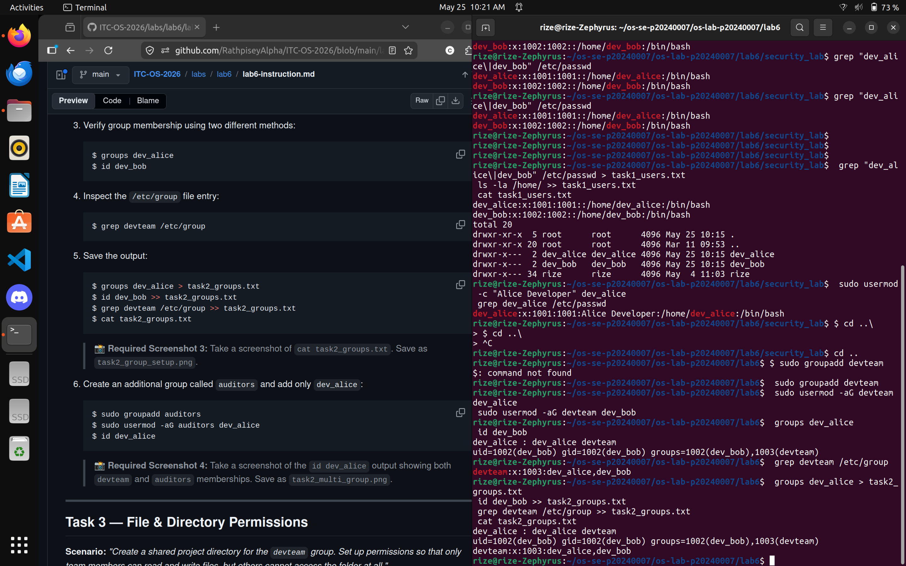

---

### Screenshot 4 — Task 2: Multiple Group Membership
Show `id dev_alice` confirming membership in both `devteam` and `auditors`.

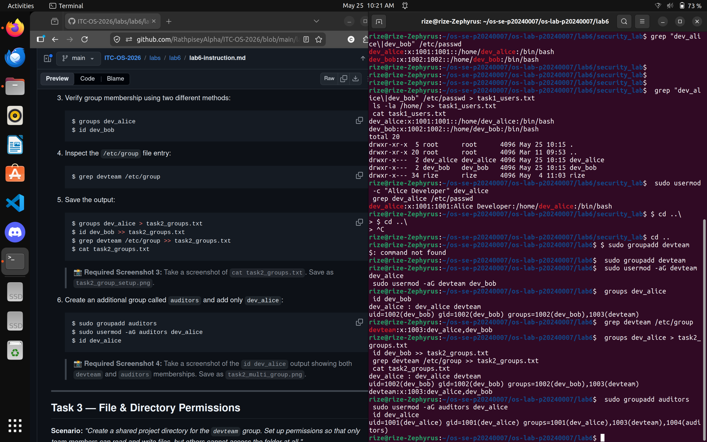

---

### Screenshot 5 — Task 3: Directory Permissions
Show `cat task3_permissions.txt` with `drwxrwx---` on the project directory.

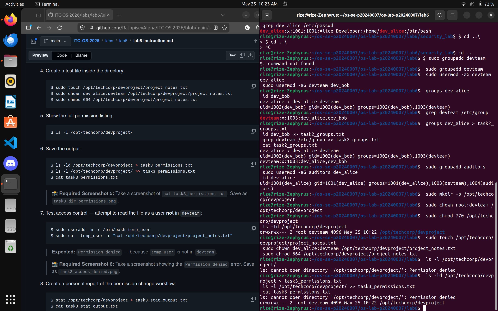

---

### Screenshot 6 — Task 3: Access Denied
Show the `Permission denied` error when `temp_user` tries to access the project directory.

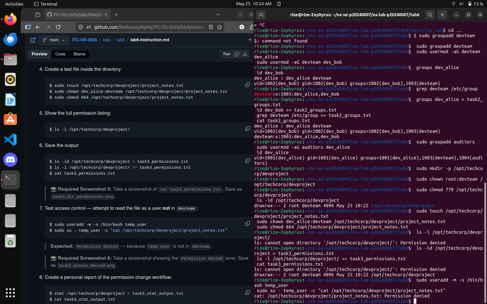

---

### Screenshot 7 — Task 4: setgid Bit
Show the directory listing with `s` in the group execute position, and `bob_file.txt` inheriting the `devteam` group.

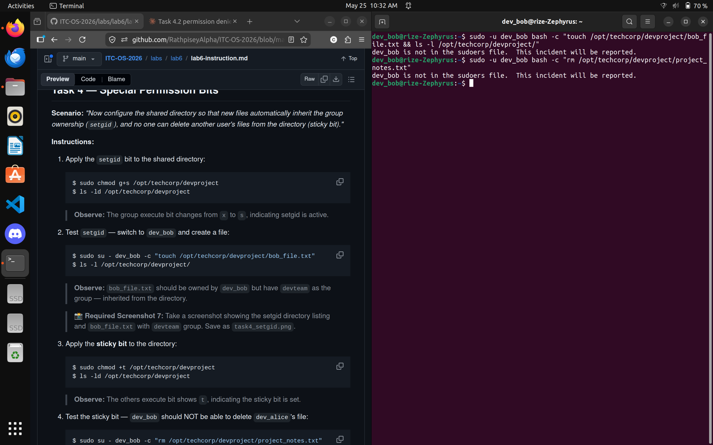

---

### Screenshot 8 — Task 4: Sticky Bit
Show the `t` bit in the directory listing and the `Operation not permitted` error when `dev_bob` tries to delete `dev_alice`'s file.

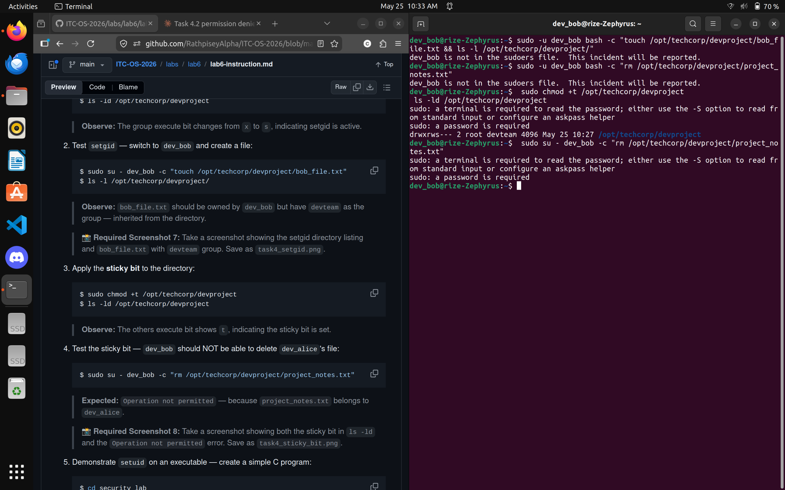

---

### Screenshot 9 — Task 4: setuid Bit
Show `ls -l whoami_suid` with `s` in the owner execute position and the program's UID output.

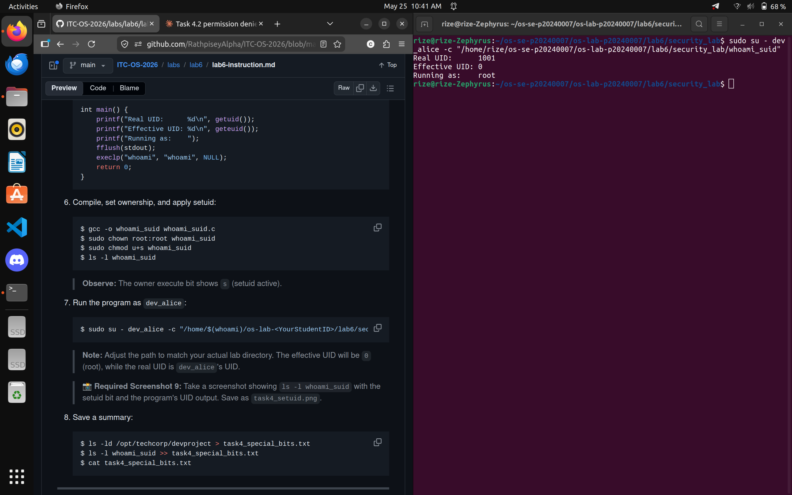

---

### Screenshot 10 — Task 5: ACL Directory
Show `getfacl /opt/techcorp/devproject` with the `auditors` ACE.

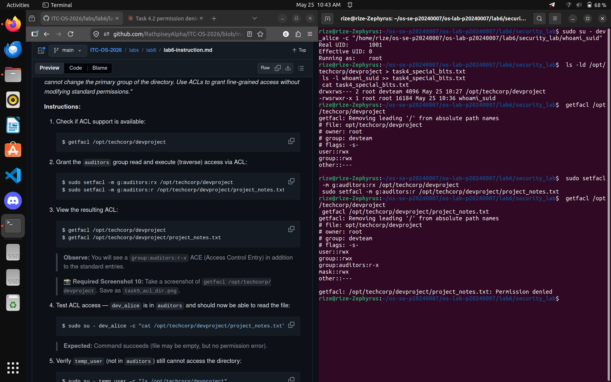

---

### Screenshot 11 — Task 5: ACL Access Test
Show `dev_alice` successfully accessing the file and `temp_user` being denied.

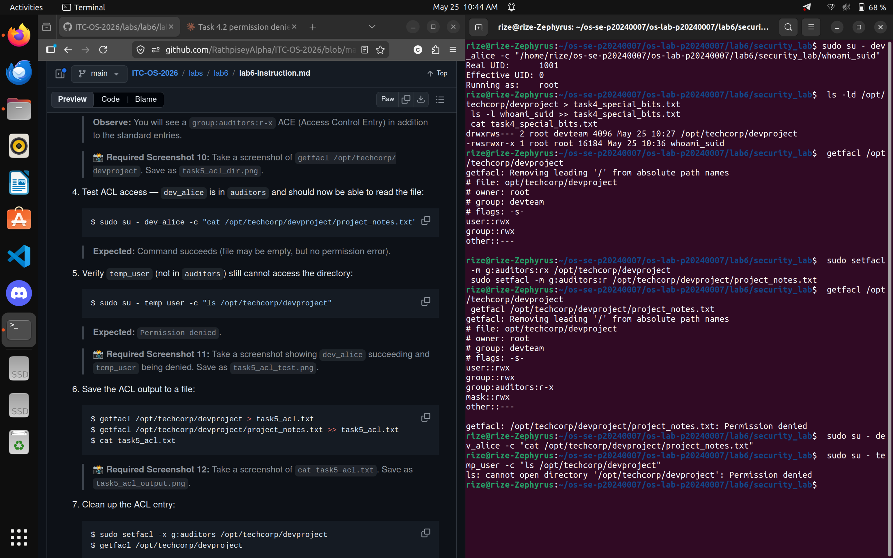

---

### Screenshot 12 — Task 5: ACL Output File
Show `cat task5_acl.txt` with the full ACL entries.

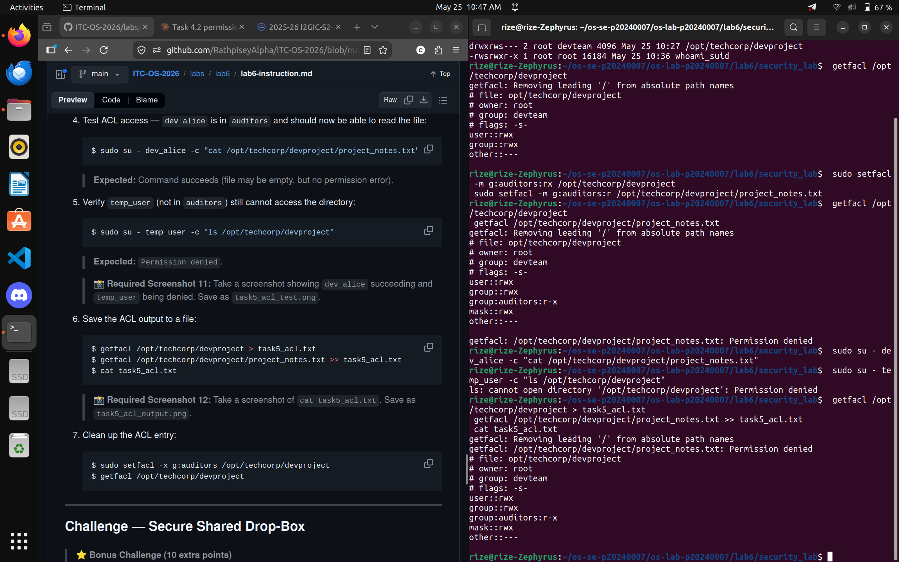

---

## Bonus Challenge — Secure Shared Drop-Box

### Challenge Screenshot — Drop-Box Setup
Show the final `ls -ld /opt/techcorp/dropbox` with both setgid and sticky bit active, and the `Operation not permitted` error when `dev_bob` attempts to delete `dev_alice`'s file.

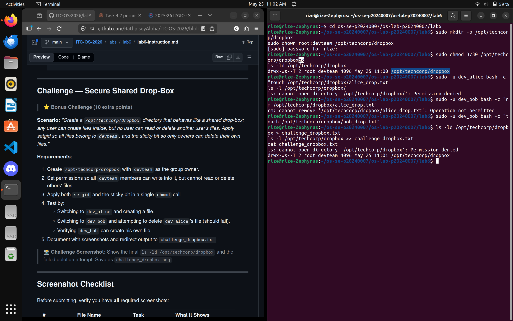

---

## Answers to Lab Questions

1. **What is the difference between `userdel` and `userdel -r`?**

   > `userdel` removes only the user account entry from `/etc/passwd` and `/etc/shadow`, leaving the user's home directory and files intact on disk. `userdel -r` additionally removes the user's home directory and all files inside it, as well as the user's mail spool. In a production environment, `userdel` alone is safer when you need to preserve data, while `userdel -r` is used when a full cleanup is required.

2. **Why is it safer to use `visudo` instead of directly editing `/etc/sudoers`?**

   > `visudo` locks the `/etc/sudoers` file to prevent simultaneous edits and, most importantly, performs a syntax validation before saving. If a syntax error is introduced, `visudo` will warn you and refuse to save the broken file. Editing `/etc/sudoers` directly with a text editor like `nano` or `vim` risks saving a malformed file, which can lock out all `sudo` access on the system — including the ability to fix the mistake.

3. **What happens when a `setgid` directory contains files created by different users? What benefit does this provide for team collaboration?**

   > When the `setgid` bit is set on a directory, any new file or subdirectory created inside it automatically inherits the group ownership of the parent directory, regardless of the creating user's primary group. For example, in `/opt/techcorp/devproject` (owned by group `devteam`), files created by both `dev_alice` and `dev_bob` will both be assigned the `devteam` group. This means all team members can read and write shared files without manually running `chgrp` after every creation, making collaboration seamless and consistent.

4. **What limitation of standard Unix permissions does the ACL system solve?**

   > Standard Unix permissions only allow one owner and one group to be assigned to a file or directory, making it impossible to grant different levels of access to multiple users or groups simultaneously. ACLs solve this by allowing fine-grained Access Control Entries (ACEs) for any number of specific users or groups. In this lab, the `auditors` group needed read-only access to `/opt/techcorp/devproject` without changing its primary group from `devteam`. Using `setfacl`, we added a separate `group:auditors:r-x` entry alongside the existing permissions — something impossible to achieve with standard `chmod` alone.