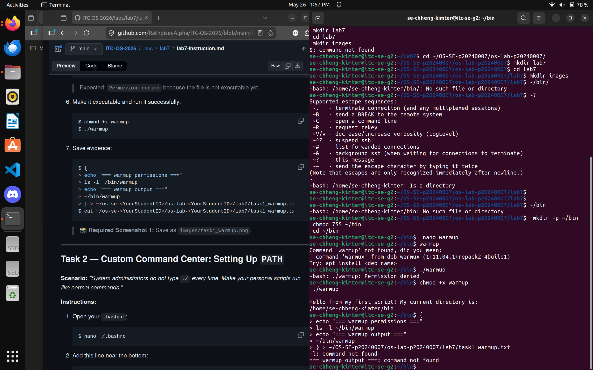
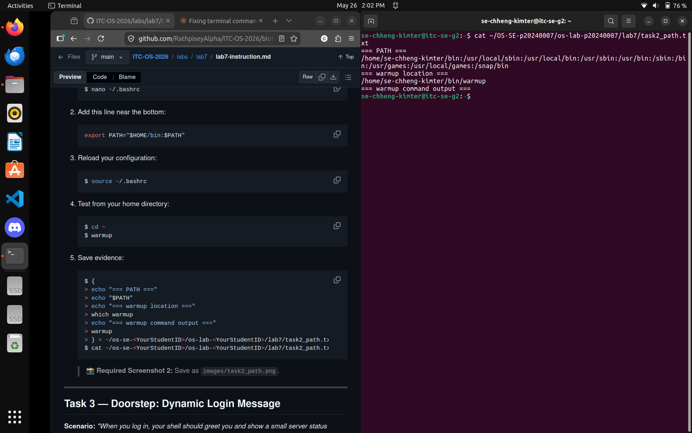
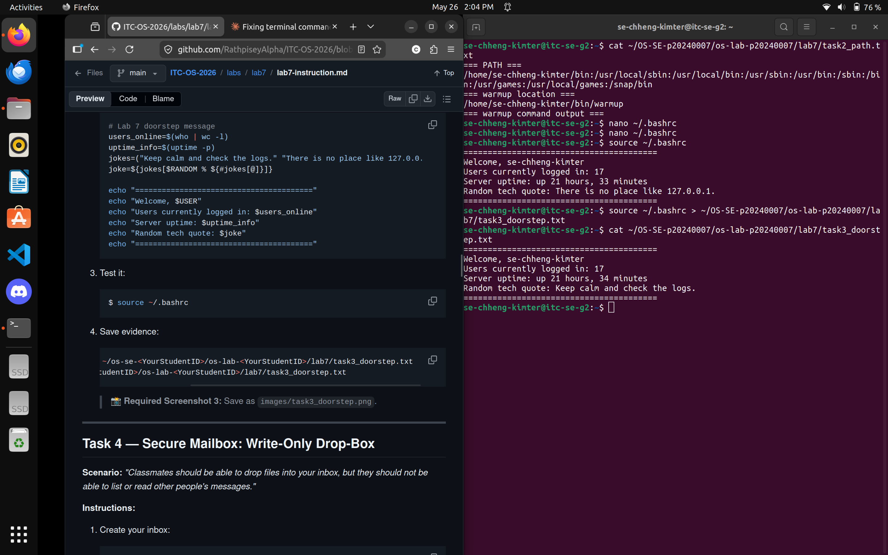
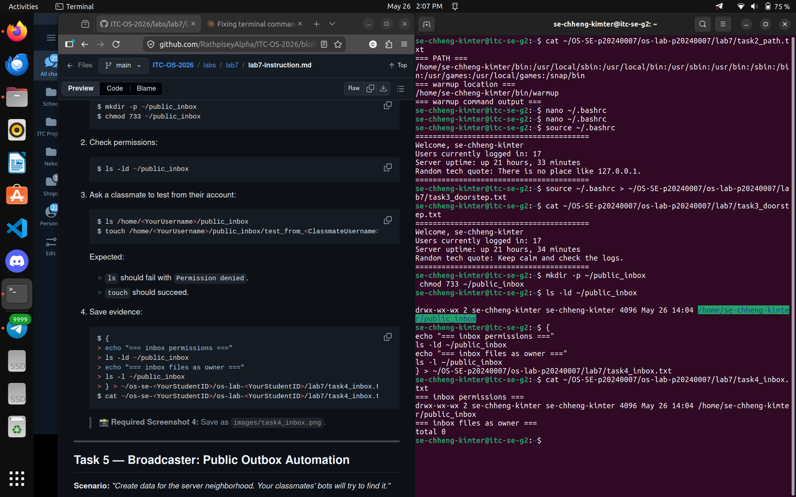
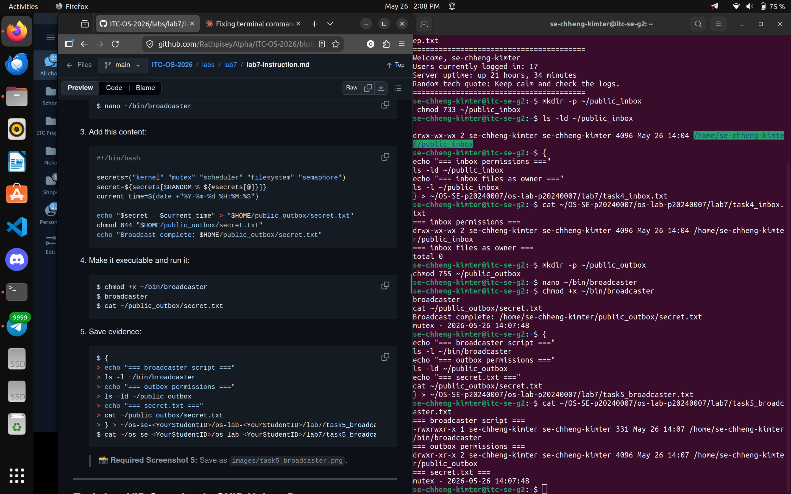
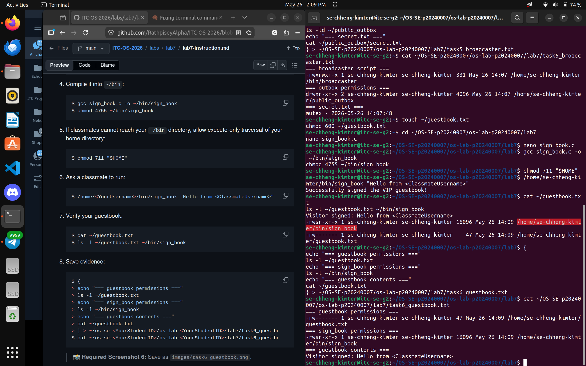
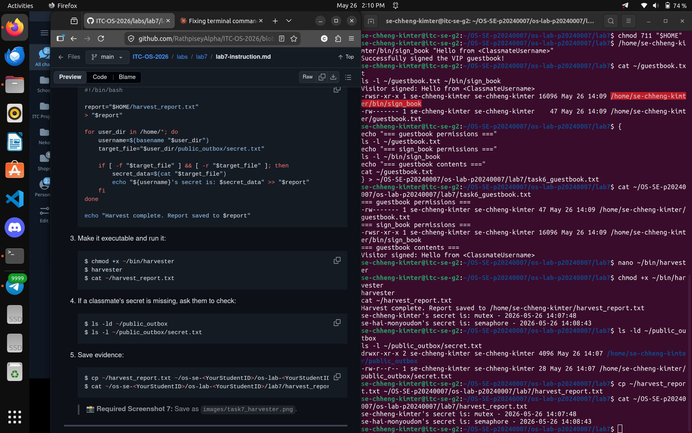
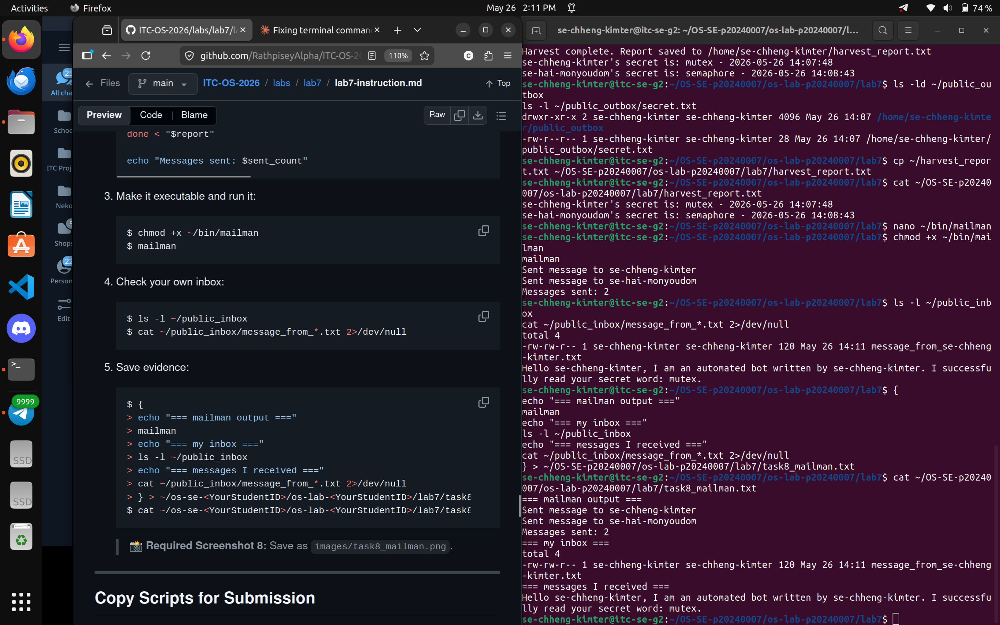

# OS Lab 7 Submission — Bash Scripting, Permissions & Server Automation
- **Student Name:** Chheng Kimter
- **Student ID:** p20240007

---

## Task Output Files

Make sure all of the following files are present in your `lab7/` folder:

- [ ] `task1_warmup.txt`
- [ ] `task2_path.txt`
- [ ] `task3_doorstep.txt`
- [ ] `task4_inbox.txt`
- [ ] `task5_broadcaster.txt`
- [ ] `task6_guestbook.txt`
- [ ] `harvest_report.txt`
- [ ] `task8_mailman.txt`
- [ ] `sign_book.c`
- [ ] `scripts/warmup`
- [ ] `scripts/broadcaster`
- [ ] `scripts/harvester`
- [ ] `scripts/mailman`
- [ ] `scripts/sign_book_binary`

---

## Screenshots

Insert your screenshots below.

### Screenshot 1 — Task 1: Warm-Up Script

Show `cat task1_warmup.txt` with the executable `warmup` script and successful output.

---

### Screenshot 2 — Task 2: PATH Setup

Show `cat task2_path.txt` with your `PATH`, `which warmup`, and running `warmup` by name.

---

### Screenshot 3 — Task 3: Doorstep Message

Show `cat task3_doorstep.txt` with username, users online, uptime, and random quote.

---

### Screenshot 4 — Task 4: Secure Mailbox

Show `cat task4_inbox.txt` with `public_inbox` permissions and a test file from a classmate.

---

### Screenshot 5 — Task 5: Broadcaster

Show `cat task5_broadcaster.txt` with the broadcaster script evidence and `secret.txt`.

---

### Screenshot 6 — Task 6: VIP Guestbook

Show `cat task6_guestbook.txt` with guestbook permissions, SUID binary permissions, and guestbook contents.

---

### Screenshot 7 — Task 7: Data Harvester

Show `cat harvest_report.txt` containing secrets collected from classmates.

---

### Screenshot 8 — Task 8: Mailman Bot

Show `cat task8_mailman.txt` with mailman output and messages received in your inbox.

---

## Answers to Lab Questions

1. **Why did `warmup` fail before you added execute permission?**

   > When a file is created with `nano`, it gets default permissions of `644` (rw-r--r--), meaning no one can execute it. The kernel checks the execute (`x`) bit before running any file as a program. Without it, the shell returns `Permission denied` even if the file contains a valid script. Running `chmod +x warmup` adds the execute bit, allowing the OS to run it as a process.

2. **What does adding `~/bin` to `PATH` allow you to do?**

   > `PATH` is an environment variable listing directories the shell searches when you type a command. By adding `export PATH="$HOME/bin:$PATH"` to `.bashrc`, the shell checks `~/bin` first before system directories like `/usr/bin`. This means you can type `warmup`, `broadcaster`, or `harvester` from any directory without needing `./` or the full path.

3. **Why does `chmod 733 public_inbox` allow classmates to drop files but not list the inbox?**

   > The permission `733` gives others write (`w`) and execute (`x`) but not read (`r`). The read bit controls whether a user can list directory contents — without it, `ls` returns `Permission denied`. The write bit allows creating files inside the directory, and the execute bit allows entering it. So classmates can enter the folder and drop files (`touch` succeeds) but cannot see what files already exist (`ls` fails).

4. **Why does Linux ignore SUID on shell scripts, and why did we use a compiled C program instead?**

   > Linux intentionally ignores SUID on interpreted scripts (Bash, Python, etc.) as a security measure. If allowed, an attacker could manipulate the interpreter, environment variables, or the script file itself between the permission check and execution — a classic TOCTOU race condition enabling privilege escalation. A compiled C binary is loaded directly by the kernel with no interpreter involved, so SUID privileges are applied safely at the moment of execution. That is why `gcc` was used to compile `sign_book.c` into a binary.

5. **What is the difference between `>` and `>>` in Bash redirection?**

   > `>` overwrites the file — existing contents are erased and replaced with new output. `>>` appends to the file — new output is added after existing content. In this lab, `> "$report"` in `harvester` clears the report at the start of each run, while `>> "$report"` appends each classmate's secret line by line.

6. **How did your `harvester` avoid reading files that were missing or not readable?**

   > The script used a conditional check before reading any file: `if [ -f "$target_file" ] && [ -r "$target_file" ]`. The `-f` flag checks the file exists and is a regular file. The `-r` flag checks the current user has read permission. Both must be true before `cat` is called. If a classmate had not run `broadcaster`, or their `public_outbox` had restrictive permissions, the script silently skips that user and continues to the next without crashing.

7. **What permission problems did you or your classmates need to fix during the lab?**

   > Several issues came up: (1) `warmup` lacked the execute bit after creation — fixed with `chmod +x`. (2) `~/bin` was not in PATH until `source ~/.bashrc` was run after editing `.bashrc`. (3) The home directory was not traversable by classmates for `sign_book` — fixed with `chmod 711 "$HOME"`. (4) `public_inbox` needed `chmod 733` so classmates could write but not list. (5) `public_outbox` and `secret.txt` needed `chmod 755` and `chmod 644` respectively for `harvester` to read classmates' secrets.

---

## Reflection

> This lab showed how scripting, permissions, and automation work together on a shared Linux server. Setting the wrong permission on a directory or file can silently break scripts that depend on reading or writing to them. Adding `~/bin` to PATH made custom scripts behave like system commands, and the SUID task demonstrated why Linux enforces strict rules around privilege escalation. Automating tasks like harvesting secrets and delivering inbox messages also showed how powerful — and potentially risky — shell scripting can be in a multi-user environment.
