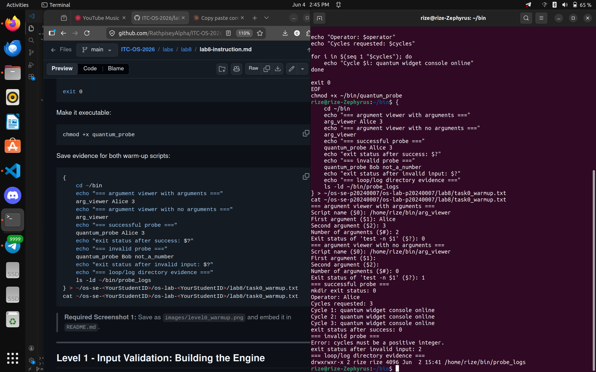
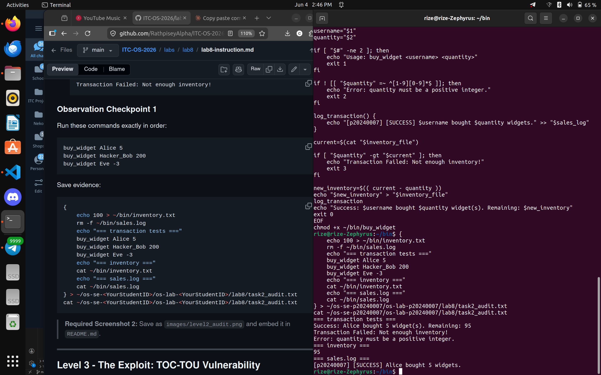
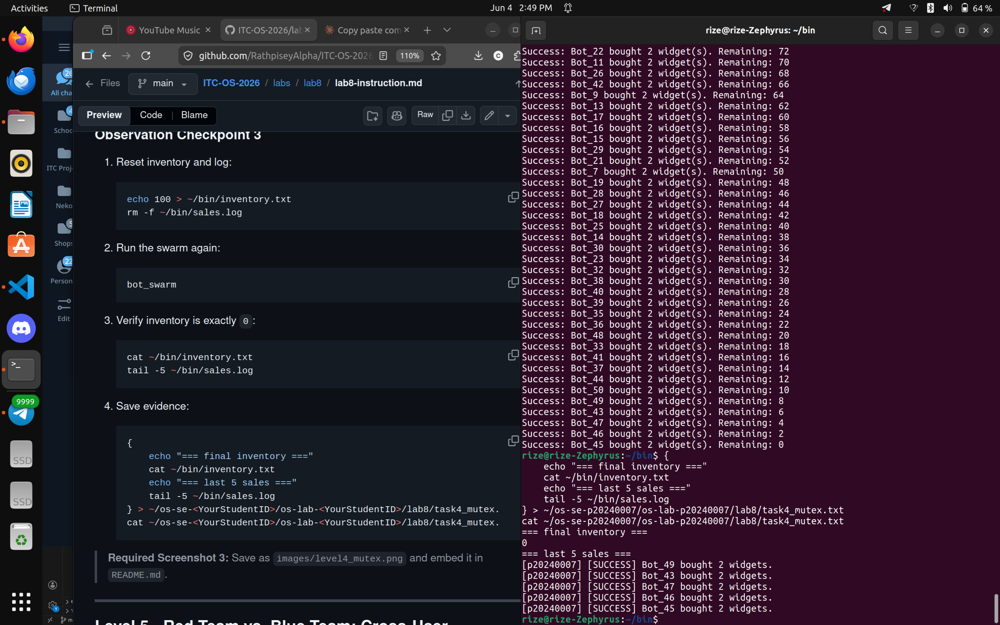
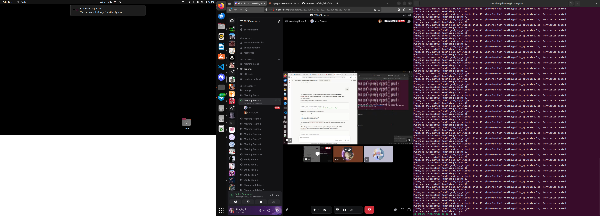
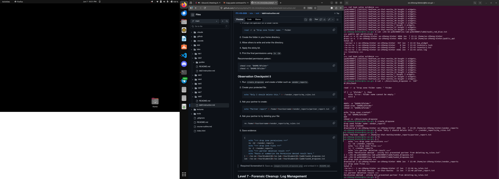
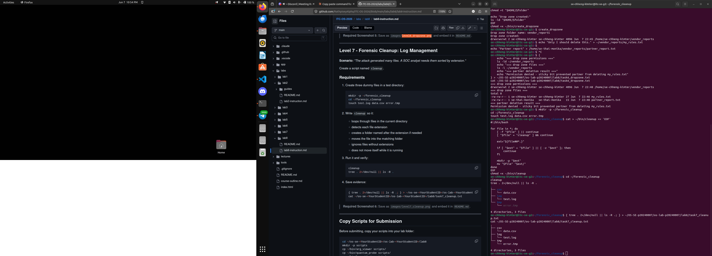

# Lab 8: Secure Bash Scripting, Race Conditions & File Locking

| | |
|---|---|
| **Name** | Chheng Kimter |
| **Student ID** | p20240007 |
| **Course** | Operating Systems |
| **Lab Title** | The Quantum Widget Exploit |

---

## Level 0 – Bash Warm-Up Scripts

---

## Level 2 – Audit Trails

---

## Level 4 – Mutex Patch

---

## Level 5 – Red Team vs Blue Team

---

## Level 6 – Secure Drop Zone

---

## Level 7 – Forensic Cleanup

---

## Lab Questions

**1. What does TOC-TOU mean, and where did it appear in the vulnerable `buy_widget` script?**

TOC-TOU stands for Time-of-Check to Time-of-Use. It is a race condition that occurs when a program checks a condition and then uses a resource, but the state of the resource changes between the check and the use. In the vulnerable `buy_widget`, the script read the inventory value, checked if enough stock was available, then wrote the new value back — but without locking. Multiple concurrent processes could all read the same inventory value before any of them wrote the updated value back, causing the inventory to be decremented incorrectly.

**2. Why did `bot_swarm` sometimes leave inventory values other than `0` before the patch?**

Because 50 background processes ran concurrently without any synchronization. The OS scheduler interleaved their execution unpredictably. Two or more bots could read the same inventory value at the same time, both calculate a new value based on the same starting number, and both write back — effectively losing some decrements. The final value depended entirely on the order the OS scheduled each process.

**3. What part of the script is the critical section, and why must it be protected?**

The critical section is the block of code that reads `inventory.txt`, checks stock availability, writes the new inventory value, and appends to `sales.log`. It must be protected because it accesses shared resources that multiple processes use simultaneously. If two processes enter this section at the same time, they will produce inconsistent results — the classic race condition.

**4. How does `flock -x` enforce mutual exclusion between concurrent processes?**

`flock -x` acquires an exclusive lock on a file descriptor. When one process holds the lock, all other processes that try to acquire it are blocked and must wait. This ensures only one process can execute the critical section at a time, preventing concurrent reads and writes to the shared inventory file.

**5. Which permissions did you use to let a classmate run your API without giving full access to your home directory?**

- `chmod o+x "$HOME"` — allows others to traverse the home directory without listing its contents
- `chmod 755 ~/public_api` — allows others to enter and list the public_api folder
- `chmod o+rx ~/public_api/buy_widget` — allows others to read and execute the script
- `chmod o+rw ~/public_api/inventory.txt ~/public_api/sales.log ~/public_api/inventory.lock` — allows others to read and write the shared data files

**6. Why does the sticky bit protect files in a shared drop zone?**

The sticky bit on a directory means that even though everyone can write to the directory, a user can only delete files that they themselves own. Without the sticky bit, any user with write permission to the directory could delete anyone else's files. With it, only the file owner or the directory owner can delete a file.

**7. What defensive scripting practice from this lab would you use in a real production script?**

Input validation is the most important practice — always reject unexpected input before processing it. File locking with `flock` is essential whenever multiple processes share a resource. Using absolute paths anchored to the script's own directory prevents bugs when scripts are called from different working directories. Audit logging ensures there is always a record of what happened, which is critical for incident response.