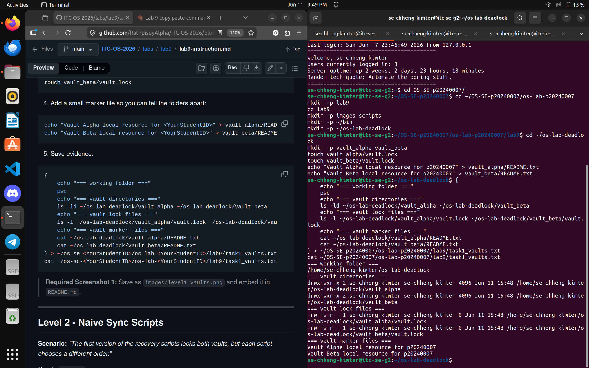
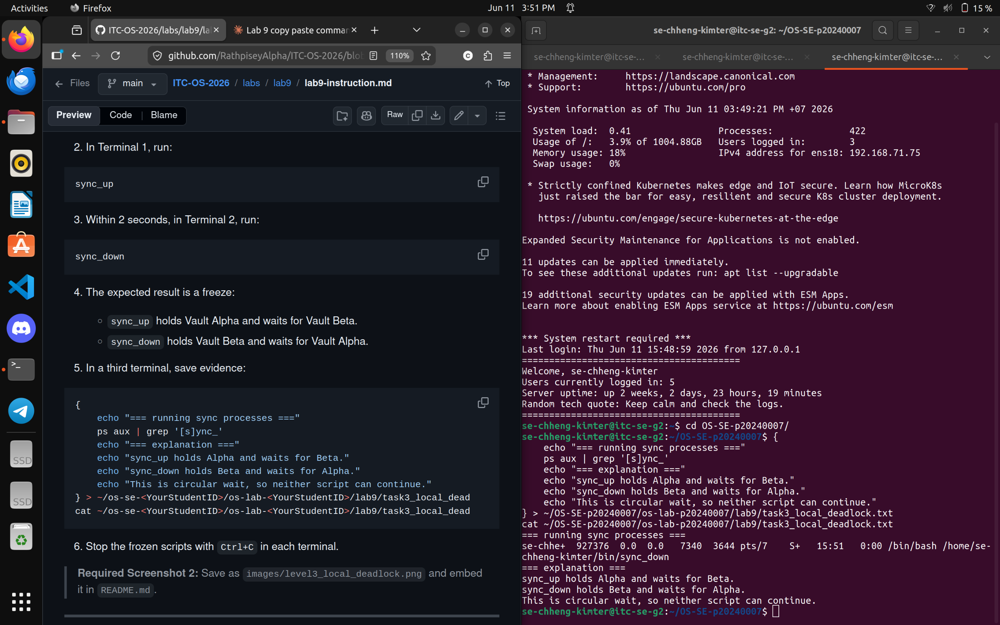
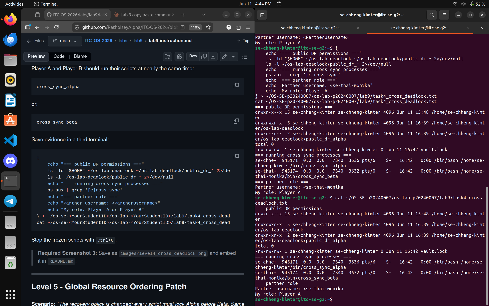
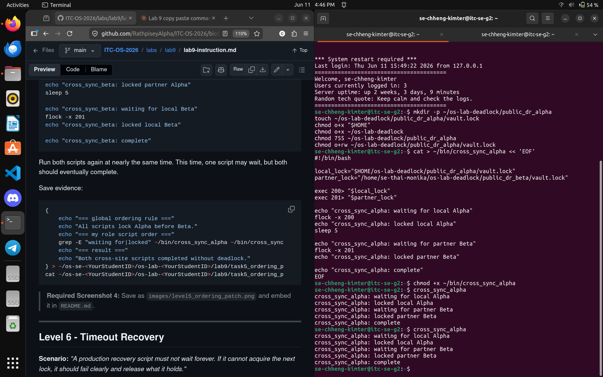
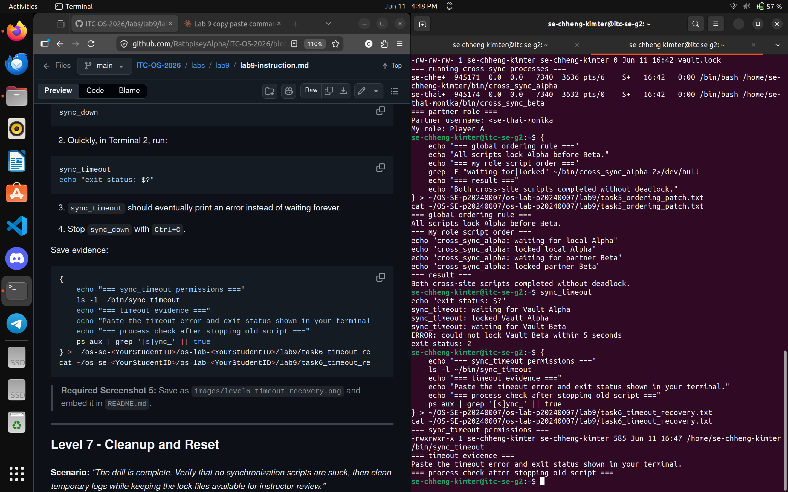
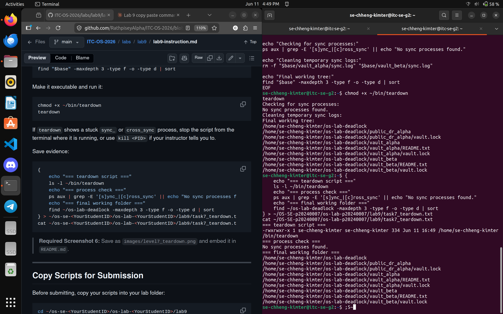

# Lab 9 - The Quantum Vault Deadlock

**Student Name:** Chheng Kimter
**Student ID:** p20240007  
**LLinux Username** Rize
**Partner username:** Thai Monika
**Role:** Player A  

---

## Screenshots

### Level 1 - Vault Workspace Setup

### Level 3 - Local Deadlock

### Level 4 - Cross-Site Deadlock

### Level 5 - Global Ordering Patch

### Level 6 - Timeout Recovery

### Level 7 - Teardown

---

## Lab Questions

**1. What does each `vault.lock` file represent in this lab?**  
Each `vault.lock` file represents a shared exclusive resource — specifically, it simulates a vault that only one process can access at a time. Any script that wants to use a vault must acquire a lock on that file using `flock` before entering its critical section.

**2. Why does `flock` require every script to lock the same shared file to coordinate correctly?**  
Because `flock` works by placing a lock on a specific file on disk. If two scripts open different files, they are locking different resources and cannot block each other. Both scripts must open and lock the exact same file path for the coordination to work — otherwise they will not see each other's locks and will both proceed freely.

**3. In the local deadlock, which resource did `sync_up` hold, and which resource did it wait for?**  
`sync_up` held the lock on Vault Alpha and was waiting to acquire the lock on Vault Beta.

**4. In the local deadlock, which resource did `sync_down` hold, and which resource did it wait for?**  
`sync_down` held the lock on Vault Beta and was waiting to acquire the lock on Vault Alpha.

**5. Which four deadlock conditions were present in Level 3?**  
- **Mutual exclusion:** Each vault lock can only be held by one process at a time using `flock -x`.  
- **Hold and wait:** `sync_up` held Vault Alpha while waiting for Vault Beta, and `sync_down` held Vault Beta while waiting for Vault Alpha.  
- **No preemption:** Neither script could forcibly take the lock from the other; each had to wait until the lock was released voluntarily.  
- **Circular wait:** `sync_up` waited for a resource held by `sync_down`, and `sync_down` waited for a resource held by `sync_up`, forming a cycle.

**6. How does the global Alpha-before-Beta ordering rule break circular wait?**  
When every script must lock Alpha before Beta, no script can hold Beta while waiting for Alpha. This makes a cycle impossible — if one script holds Alpha and waits for Beta, any other script that wants Alpha must wait first, so it never holds Beta while waiting. The cycle that causes deadlock can never form.

**7. Why is `flock -w` useful for recovery even though it does not prevent every deadlock?**  
`flock -w` gives a script a bounded wait time instead of waiting forever. If the lock cannot be acquired within the timeout, the script exits with an error and releases any locks it already holds. This prevents the system from freezing indefinitely even when a deadlock or long contention occurs, allowing operators to detect the failure and retry.

**8. Why should you check for stuck processes before finishing a deadlock lab?**  
Stuck processes continue to hold locks on shared files even after the lab activity ends. If they are not cleaned up, they block any future script from acquiring those locks, making the vault resources unavailable. Checking for and stopping stuck processes ensures the environment is fully reset and no leftover state interferes with grading or the next lab session.